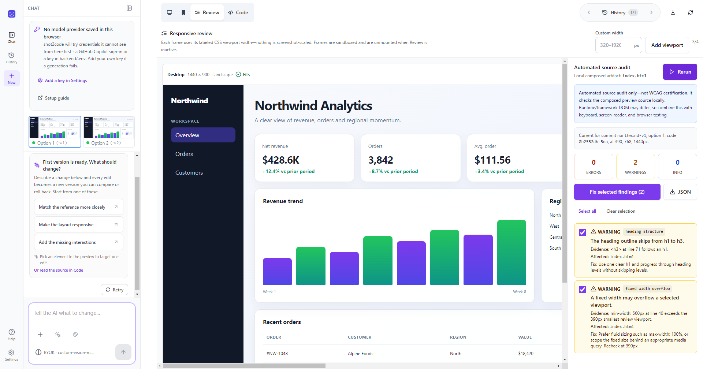
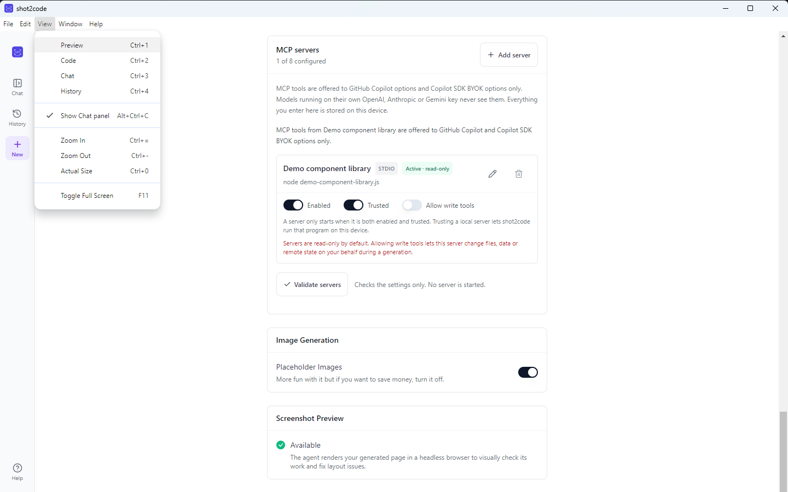
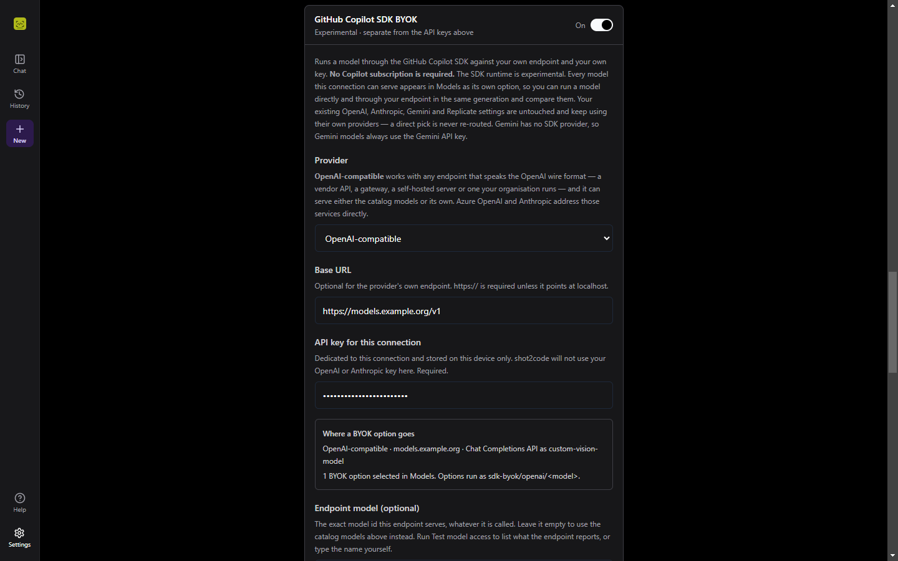
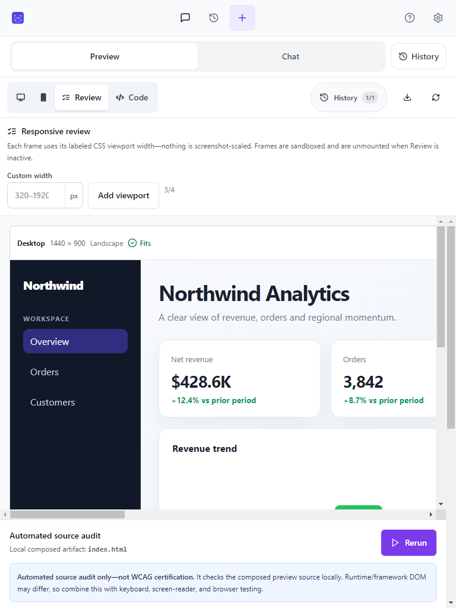

# shot2code

[](https://github.com/ArasaniRohithReddy/shot2code/releases/latest)
[](LICENSE)
[](#install)
[](CHANGELOG.md)

Turn screenshots, mockups, designs and screen recordings into clean, working
code — using AI, on your own machine.

shot2code is a **desktop app for Windows**. The app, project history and
credentials live on your machine; generation data goes only to the model
provider or endpoint you explicitly select, and MCP tools run only through
servers you explicitly enable and trust.

## Screenshots

<!-- Every image below has descriptive alt text; the summaries repeat the key
     detail so the gallery is usable without loading the images. -->

The responsive Review workspace renders the synthetic Northwind Analytics
project at real CSS widths and audits its generated source locally:



Provider configuration in the light and dark themes:

| MCP tools and native menu | Copilot SDK BYOK |
|---|---|
|  |  |

At 768×1024, Review becomes a single-column workspace while keeping Preview,
Chat and History as separate destinations:



## Install

**Requirements:** Windows 10 or 11, 64-bit (x64). The installer unpacks roughly
600 MB, because the Python backend and a headless Chromium ship with the app.
There are no macOS or Linux builds; on those platforms, run it
[from source](#running-from-source).

Download the latest build from
[Releases](https://github.com/ArasaniRohithReddy/shot2code/releases/latest):

| File | Use |
|---|---|
| `shot2code-<version>-x64.exe` | **Recommended.** Installer with shortcuts, and the only self-updating format |
| `shot2code-<version>-x64.msi` | Per-machine managed deployment; updates are administrator-controlled |
| `shot2code-<version>-x64.zip` | Portable — unzip and run `shot2code.exe` |

> **Windows will warn you.** The builds aren't code-signed, so you'll see
> *"Windows protected your PC"*. Click **More info → Run anyway**, or right-click
> the file → **Properties** → **Unblock** → **Apply**. See
> [Troubleshooting](Troubleshooting.md).

Because there is no signature to check, verify the download instead. Published
SHA-256 checksums live in [`docs/releases/`](docs/releases/) —
[v0.4.0](docs/releases/v0.4.0/SHA256SUMS.txt),
[v0.3.3](docs/releases/v0.3.3/SHA256SUMS.txt),
[v0.3.2](docs/releases/v0.3.2/SHA256SUMS.txt),
[v0.3.1](docs/releases/v0.3.1/SHA256SUMS.txt) and
[v0.3.0](docs/releases/v0.3.0/SHA256SUMS.txt):

```powershell
Get-FileHash .\shot2code-0.3.1-x64.exe -Algorithm SHA256
```

First launch takes about a minute while the bundled backend starts. Later
launches are quicker.

NSIS-installed builds check GitHub Releases automatically. Settings shows the
running version, update status, download progress, **Check now**, and
**Restart & install** when an update is ready. Updates install silently after
the backend, Copilot CLI and Chromium process tree has fully stopped — and if
that shutdown can't be confirmed, the install is aborted and stays retryable
rather than replacing a running app. MSI installs are per-machine and leave
upgrades to the administrator.

What changed in each release: [CHANGELOG.md](CHANGELOG.md).

## Using it

Give shot2code a screenshot, several related screenshots, a URL, a text
description, or a screen recording, and it generates a working page. It
produces several variants in parallel so you can pick the best one, then refine
it by describing what to change.

Supported output stacks:

- HTML + Tailwind
- HTML + CSS
- React + Tailwind
- Vue + Tailwind
- Bootstrap
- Ionic + Tailwind
- Alpine.js + Tailwind
- Preact + Tailwind
- Tailwind + daisyUI
- Bulma
- Material 3
- htmx + Tailwind

Other things it can do:

- **Select an element and edit it** by describing the change
- **History** — every generation is a commit you can step back through, and
  retried versions keep a link to the version they re-roll. Open it from the
  **History** button in the preview toolbar, the app rail, the tablet/mobile
  header, or with **Ctrl+4**.
- **Projects are saved on your machine** — a local SQLite database
  (`history.sqlite3` under `%LOCALAPPDATA%\shot2code\`) keeps your projects,
  versions and prompts, so **Recent projects** can pick up where you left off.
  Deleting a project removes it and its versions from the device.
- **Screenshot preview** — the agent renders its own output in a headless
  browser and visually checks its work. Settings shows whether it is available
  and offers **Check again** after you install the browser, so you do not have
  to restart the app.
- **Responsive Review** — compare two to four real viewport widths at once,
  measure horizontal overflow, and run a deterministic local semantic and
  accessibility source audit. Selected findings can be inserted into Chat
  without being sent automatically.
- **MCP tools for Copilot runtimes** — connect bounded stdio, HTTP or SSE
  servers. A server must be enabled and trusted, stays read-only unless write
  tools are explicitly allowed, and is never exposed to native OpenAI,
  Anthropic or Gemini variants.
- **Asset extraction** — reuses the real logos and images from your screenshot
  (needs a Gemini key)
- **Image generation and editing** (needs a Replicate key)
- **Existing-project import** — choose a folder, ZIP, or source files, review
  the detected stack and safe file counts, then use the result as compact design
  context or hand the normalized files to the editable project workflow.
- **Multi-screenshot modes** — choose whether screenshots are separate pages,
  responsive views, UI states, or supporting references. Separate pages is the
  default, and every screenshot must be represented.
- **Project export** — generated single-page output uses an explicit Vite
  strategy for every supported stack, while multi-file source projects are
  preserved without inventing unsafe framework scaffolds.
- **A workspace you can quiet down** — collapse the chat panel to give the
  preview or the editor the full window, and reformat an HTML, CSS, JavaScript
  or JSON file with the **Format** action, which only ever changes whitespace.
- **A workspace you can resize** — on wide windows (≥ 1280px), drag the divider
  between the chat and the preview, or between the file tree and the editor, to
  set how the width is shared. The dividers are focusable separators: arrow keys
  move them 16px at a time, **Shift** makes that 64px, **Home** and **End** jump
  to the narrowest and widest allowed widths, and **Enter** or a double-click
  restores the default. Widths are remembered per browser, are clamped so
  neither side becomes unusable, and are a view preference only — resizing never
  touches a project's versions, options, or history.

### Help

**Ctrl+/** or the **Help** button in the app rail opens the Help centre. It has
four sections: **Get started** (connect a model, then go from a screenshot to an
export), **Guides** (the published architecture, data-handling, security,
changelog, release and contributing documents), **Support** (FAQ,
troubleshooting, the issue tracker, and the source repository), and **Keyboard
shortcuts**. Every link opens in your browser and points at the
[shot2code product page](https://arasanirohithreddy.github.io/app-releases/shot2code/)
or its documents in the
[release hub](https://github.com/ArasaniRohithReddy/app-releases/blob/main/products/shot2code/).
In the desktop app, Support also offers **Open diagnostic logs**, which opens the
log the shell writes for backend startup, renderer crashes and console errors —
the first thing to attach to a bug report. The browser build has no log file and
says so rather than offering a dead button.

### Keyboard shortcuts

Every shortcut is listed in Help (**Ctrl+/**). Project actions use conflict-free
Ctrl+Alt combinations: **Ctrl+Alt+N** starts a project, **Ctrl+Alt+I** opens
Import, **Ctrl+Alt+U** opens Upload, **Ctrl+Alt+S** opens Settings, and
**Ctrl+Alt+E** exports the current project. Use **Ctrl+1–4** for Preview, Code,
Chat, and History, **Ctrl+Alt+C** to show or hide the Chat panel, and
**Ctrl+Shift+Enter** to retry an AI-generated version. On wide windows,
**Ctrl+Alt+C** collapses the chat panel, and **Ctrl+1** or **Ctrl+4** bring it
back. Navigation shortcuts pause while typing
or while a dialog is open. In the code editor, Tab moves focus out and
**Ctrl+]** indents. In the desktop app, use **Ctrl+=** or **Ctrl++** to zoom in,
**Ctrl+-** to zoom out, and **Ctrl+0** to reset; the numpad add and subtract
keys work with Ctrl as well.

### Application menu (desktop app)

The desktop app has a real menu bar rather than Electron's stock one, and every
item runs the same command the keyboard runs — the menu can never do something
the shortcut does not.

| Menu | Items |
| --- | --- |
| **File** | New project, Upload screenshots, Import project, Export current project, Settings, Exit |
| **Edit** | Undo, Redo, Cut, Copy, Paste, Delete, Select All |
| **View** | Preview, Code, Chat, History, Show Chat panel, Zoom In/Out/Actual Size, Toggle Full Screen |
| **Window** | Minimize, Close |
| **Help** | Help center, Keyboard shortcuts, Product page, Documentation (User guide), All releases, Report an issue, Open diagnostic logs, About shot2code |

Each item shows the accelerator published in Help, but deliberately does not
capture it: the keystroke stays with the page, so **Ctrl+Z** still drives
CodeMirror's own history, **Ctrl+/** still toggles a comment inside the editor,
and Ctrl+=/-/0 still run through the app's single zoom handler. Clicking a menu
item raises the window first, so a command works even when the window is
minimised or behind something. Items that need a project — Export and the
workspace views — are greyed out until one is open. **Reload** and **Toggle
Developer Tools** appear only in a development build, so a release cannot reload
the renderer out from under a running generation. Help links open in your
browser and point at the same published pages the Help centre uses.

### Preview and CodePen

The file tree in the Code tab is always the authoritative project source. The
in-app preview is a derived, self-contained HTML artifact: browser-ready local
CSS, JavaScript, images, SVGs and encoded fonts are embedded when possible. If
a framework build or local asset cannot be represented safely, the preview
shows a deterministic fallback/diagnostic while leaving every source file
available for editing and project download. Generated preview documents run in
an opaque-origin sandbox with a restrictive CSP; select-and-edit communicates
through validated, per-preview messages instead of direct parent-window access.

The preview renders a fixed-width canvas — 1366px for desktop, 375px for mobile
— centred on a neutral backdrop so a wide window never leaves a misleading blank
strip beside it. **Fit** scales the desktop canvas down to the window (the
button shows the current percentage) and **100%** keeps it at its original size,
scrolling instead of clipping. Below 640px the canvas always fits, because a
1366px page at 100% cannot be read on a phone.

CodePen sharing is available only when the selected stack can run honestly in a
browser-only Pen. The app splits document head, HTML, CSS and JavaScript, keeps
module/defer/nomodule/import-map ordering where CodePen externals cannot express
it, and never guesses missing framework resources. Sharing always asks first
because code leaves the device and public Pens may be visible to others. For
build-dependent projects, use **Project folder** download instead.

### Export formats

Single-HTML exports keep the generated document intact, pin the working Babel
runtime, and bundle downloaded images/fonts under `assets/`. Project exports
use the following explicit strategies:

| Stack | Single HTML | Project folder |
|---|---|---|
| `html_tailwind` | Standalone HTML + Tailwind CDN | Vite HTML with safe `styles.css` / `script.js` extraction |
| `html_css` | Standalone HTML/CSS/JS | Vite HTML with safe `styles.css` / `script.js` extraction |
| `react_tailwind` | React UMD + pinned Babel + Tailwind CDN | Vite React when one canonical Babel block is safely transformable; otherwise documented Vite HTML fallback |
| `bootstrap` | Standalone HTML + Bootstrap CDN | Vite HTML retaining Bootstrap resources and order |
| `vue_tailwind` | Vue global build + Tailwind CDN | Documented Vite HTML using the working global-build app; no fake SFC extraction |
| `ionic_tailwind` | Pinned Ionic 8 ESM/styles + Tailwind CDN | Vite HTML retaining the supported Ionic module and stylesheet without the broken nomodule URL |
| `alpine_tailwind` | Alpine + Tailwind CDN | Vite HTML retaining directives and deferred runtime |
| `preact_tailwind` | Preact/HTM ESM + Tailwind CDN | Vite Preact with npm imports when canonical ESM is safely transformable; otherwise documented Vite HTML fallback |
| `tailwind_daisyui` | Tailwind + daisyUI CDNs | Vite HTML retaining matched Tailwind/daisyUI resources |
| `bulma` | Standalone HTML + Bulma CDN | Vite HTML retaining the pinned Bulma stylesheet |
| `material_web` | Pinned Material Web ESM + Material Symbols | Vite HTML retaining external modules, font stylesheet, and import order |
| `htmx_tailwind` | htmx + Tailwind CDNs | Vite HTML retaining htmx behavior and runtime order |

Generated HTML/CDN projects use Vite for local development and a deterministic
static-copy production build, so external inline modules are not accidentally
rebundled or reordered. React and Preact transformations use Vite's framework
build path. Downloaded assets and classic `script.js` are copied into `dist/`;
inline modules, import maps, special script/style types, and ambiguous multi-block
resources stay in `index.html` rather than being moved unsafely.

When the editor sends a multi-file project, export treats that source tree and
its declared entry point as authoritative, even if the preview used a composed
HTML fallback. Existing package and framework configuration is preserved. If no
valid root `package.json` build command is present, export keeps every source
file and adds a **Safe fallback** note instead of generating a plausible but
potentially broken scaffold. Downloaded image/font references are rewritten
relative to each referencing file without changing module or script order.

### Multiple screenshots

When more than one screenshot is uploaded, shot2code asks how they relate:

| Mode | Behaviour |
|---|---|
| Separate pages | One navigable route/view per screenshot; none may be omitted |
| Responsive views | One page, with breakpoints inferred from the screenshots |
| UI states | One interface with interactions that move between the states |
| Supporting references | Screenshot 1 is the target; the rest clarify details |

### Import an existing project

Open **Import → Folder, ZIP or source files** and choose a project folder, ZIP
archive, or selected source files. shot2code validates paths and size limits,
ignores dependency/build output, rejects unsafe or malformed input, and detects
the likely framework from package metadata, source files and CDN tags without
executing configuration or application code.

After inspection, choose **Use as design context** to persist only the bounded
`ProjectContext` summary, or **Open editable project** when the current editor
can consume the versioned normalized file payload. Raw source is held only for
the active editable-import handoff; it is never added to persisted project
context. The active context appears above every input tab and can be cleared.

## Choosing a model

You need **one** provider. GitHub Copilot is easiest because it needs no API key.

| Provider | Setup | Notes |
|---|---|---|
| **GitHub Copilot** ⭐ | **Sign in with GitHub** in Settings, or `gh auth login` / `copilot` — needs an active Copilot subscription | Claude, GPT, Gemini and Grok through one sign-in |
| **Copilot SDK BYOK** | One OpenAI-compatible, Azure OpenAI or Anthropic endpoint and its own credential | No Copilot subscription required; appears as a separate model group and never re-routes a native provider |
| Gemini | API key | Also powers asset extraction and **video input** |
| Anthropic | API key | |
| OpenAI | API key | |
| Replicate | API key | Image generation, editing, background removal |

Keys go in **Settings** (gear icon) and are stored on your device only.
Replicate is the exception — it must be set in `backend/.env`. Every key is
masked in the UI and is never echoed back by a diagnostic, a validation
response, a log line, project history or an exported report.

### Checking a provider before you generate

Settings can test each provider individually instead of making you find out
mid-generation. A check makes **one minimal but real request** — deliberately
tiny, though the account may still be billed a negligible amount for it — and
reports what came back in plain terms: ready, credentials, billing, quota,
permissions, model, network or configuration. An OpenAI account with no credit
left, for example, is reported as a billing problem with "add credits", not as
an unexplained failure. Replicate is checked against its account endpoint
rather than by running a prediction.

A check uses the key in that request when you supply one, otherwise the key the
backend was started with. **A custom OpenAI base URL must carry its own key in
the same request**: the key configured on the server belongs to the server's own
endpoint and is never sent to an address a request names. Caller-supplied URLs
are held to the same rules as a BYOK endpoint — `http`/`https` only, no
credentials embedded in the URL, and HTTPS unless the host is loopback.


### Picking which models generate

**Settings → Models** lists every provider you have credentials for, grouped by
provider, and the compact picker in the composer and edit toolbar shows the same
list. Tick the models you want: each generation produces **one option per
selected model**, up to the per-run limit (four for a new generation, two for an
edit or a video). Leave everything unchecked and shot2code chooses for you.

Copilot's list is discovered live from your plan; the API-key providers use a
validated list maintained with shot2code, so each entry is a model this app has
actually been run against. Superseded models are hidden behind **Show deprecated
models**, and a saved pick that can no longer run — a retired model, or one whose
key you removed — is flagged so you can clear it instead of silently losing an
option. Models that can't read images never appear, since turning a screenshot
into code requires image input, and video runs only offer models that can read a
recording.

### GitHub Copilot

shot2code uses the official
[GitHub Copilot SDK](https://github.com/github/copilot-sdk), which finds
credentials in this order:

1. A token in Settings
2. `COPILOT_GITHUB_TOKEN` / `GH_TOKEN` / `GITHUB_TOKEN`
3. A stored `copilot` CLI login
4. A stored `gh auth login`

So if you already use the GitHub CLI, it just works — Settings shows which
account was picked up. Otherwise create a fine-grained token with the
**Copilot Requests** permission.

**Sign in with GitHub** in Settings does the same thing without a terminal. It
runs the *official* Copilot CLI's own browser sign-in (`copilot login`), falling
back to `gh auth login` when only the GitHub CLI is installed. shot2code never
implements its own OAuth flow and never registers a client id of its own: the
CLI owns the browser handshake and stores the credential itself, so **no token
passes through shot2code**. The command line is fixed — nothing you type
influences it — the process is launched directly rather than through a shell,
its output is never shown or logged, and it is bounded by a timeout, cancellable
and killed if the app exits. When the CLI finishes, shot2code simply re-runs the
credential check above.

If neither CLI is installed, Settings says so and links to GitHub's install
instructions rather than pretending to sign you in. Starting or cancelling a
sign-in is accepted only from shot2code's own window on this machine, so a web
page you happen to have open cannot trigger it.

### GitHub Copilot SDK BYOK

**Settings → GitHub Copilot SDK BYOK** adds one endpoint of your own through the
Copilot SDK. It supports any standards-compatible OpenAI-style server, Azure
OpenAI and Anthropic. The connection has its own API key or bearer token, and
direct OpenAI/Anthropic credentials are never borrowed for it. An
OpenAI-compatible endpoint on `localhost` may be credentialless; every other
endpoint needs its own. Base URLs must be `https` unless they point at loopback,
and may not embed credentials. The SDK has no native Gemini BYOK provider.

**Finding the model.** For an OpenAI-compatible connection, **Validate** asks
the endpoint what it serves at `/models` and lists what comes back (bounded, and
only ids it could actually select). That route is optional in practice: if the
endpoint does not implement it, shot2code says so and you name the model
yourself. Azure OpenAI and Anthropic do not expose an equivalent list, so their
model name is always set by hand. A listing that fails for a real reason — a
rejected key, an unreachable host — is reported as such; shot2code never invents
a model list.

**Wire API.** Chat Completions is what every compatible endpoint implements, so
a connection with its own base URL defaults to it; a vendor connection with no
base URL of its own defaults to Responses. Either can be chosen explicitly.

**Your own model.** Name a model in **Model / deployment** and that single model
is what the picker offers, under its real name — shot2code does not list a whole
vendor family for an endpoint that serves one model. Its identity is
`sdk-byok/<provider>/custom/<model>`, URL-encoded so a slash, colon or `@` in the
name stays intact and can never collide with a catalog id. Model names are
bounded to 128 characters. Internally the run borrows a neutral, non-reasoning
template so the SDK knows how to shape the conversation, and **no GPT or Claude
thinking level is sent** to a model that has no such concept — only the real
model name goes on the wire.

**What the model must support.** shot2code drives a model with screenshots and
tool calls, so a BYOK model needs **image input (vision) and tool calling**. A
successful check says the endpoint answered; it cannot prove those two
capabilities, so the requirement is repeated with the result, and an endpoint
that rejects a tool or an image is reported as a model problem rather than a
mystery.

BYOK is additive. Models appear under **Copilot SDK (BYOK)** with identities
such as `sdk-byok/azure/gpt-5.6-sol (high thinking)` for a catalog model, or
`sdk-byok/openai/custom/your-model` for your own. A native model and its BYOK
twin can be selected in the same generation and remain distinct in History and
retries; a retry replays the identity while using whatever the connection is
configured with today. Direct OpenAI, Anthropic, Gemini, Replicate and
Copilot-subscription credentials and routing are unchanged.

### MCP servers

Settings accepts up to eight MCP servers over stdio, HTTP or SSE. Local servers
are spawned directly from an argument vector, never through a shell; remote
servers require HTTPS except on localhost. A server must be both **Enabled**
and **Trusted** before a Copilot subscription or SDK-BYOK option can use it.
Tools are read-only by default, and **Allow write tools** is a separate,
explicit permission. Native OpenAI, Anthropic and Gemini variants never receive
MCP tools.

Environment values and request headers are masked and excluded from History,
logs, validation responses and Review reports. Disabled, untrusted or
incomplete drafts are reported as notices and do not block direct generations.

### Responsive Review

The **Review** destination renders the current project at two to four actual CSS
viewport widths at once. The defaults are 1440px, 768px and 390px; custom
widths may range from 320px to 1920px. Each frame reports real horizontal
overflow rather than estimating it from a screenshot.

Beside the frames, a deterministic local audit checks generated source for
semantic and accessibility problems. Results are bound to the version, option,
source hash and viewport set, so changing any of them marks the report stale.
Selected findings are inserted into Chat for review and editing but are never
sent automatically. JSON reports contain findings and safe relative file
labels, not source code or credentials. This is an automated source audit, not
WCAG certification.

## Running from source

Requires [uv](https://docs.astral.sh/uv/), [pnpm](https://pnpm.io/) and Node 18+.

```bash
# Backend
cd backend
uv sync
uv run playwright install chromium-headless-shell   # optional: screenshot preview
uv run uvicorn main:app --reload --port 7001

# Frontend (in another terminal)
cd frontend
pnpm install
pnpm dev
```

Open http://localhost:5173.

On macOS/Linux, `bash scripts/install.sh` installs everything in one go.

### Docker

```bash
echo "GEMINI_API_KEY=your-key" > .env
docker-compose up -d --build
```

For a much smaller image without the screenshot-preview tool:

```bash
docker build --build-arg INSTALL_CHROMIUM=false -t shot2code-backend ./backend
```

### Building the desktop app

Windows 10/11 x64, PowerShell, from the repository root:

```powershell
# Renderer
cd frontend
pnpm install
pnpm build
cd ..

# Backend, frozen with PyInstaller
cd backend
uv sync
uv run pyinstaller shot2code-backend.spec --noconfirm --distpath dist-pyinstaller

# Only the headless shell: the app always launches headless
$env:PLAYWRIGHT_BROWSERS_PATH = "$PWD\dist-pyinstaller\shot2code-backend\ms-playwright"
uv run playwright install chromium-headless-shell
Remove-Item Env:\PLAYWRIGHT_BROWSERS_PATH
cd ..

# Stage the payloads electron-builder expects
Remove-Item -Recurse -Force desktop\renderer, desktop\backend-dist -ErrorAction SilentlyContinue
Copy-Item -Recurse frontend\dist desktop\renderer
Copy-Item -Recurse backend\dist-pyinstaller\shot2code-backend desktop\backend-dist

# Installers -> desktop\dist
cd desktop
npm install
npx electron-builder --win nsis msi zip --publish never
```

That produces the NSIS `.exe` and its `.exe.blockmap`, `latest.yml`, the `.msi`
and the portable `.zip` in `desktop/dist`.

Pushing a `v*` tag runs a GitHub Actions workflow that builds all three formats
to prove packaging still works — it deliberately **never publishes**. Releases
are cut from a locally verified build; see
[docs/RELEASING.md](docs/RELEASING.md).

## Documentation

- [Changelog](CHANGELOG.md) — what changed in each release
- [Troubleshooting](Troubleshooting.md) — install warnings, blank windows, sign-in
- [Support](SUPPORT.md) — where to ask, and what to include in a report
- [Security](SECURITY.md) — reporting vulnerabilities, API keys, unsigned
  binaries, update integrity, and how imported code is handled
- [Contributing](CONTRIBUTING.md) — setup, tests, and pull request conventions
- [Code of Conduct](CODE_OF_CONDUCT.md)
- [Testing](TESTING.md) — how to run tests and type checks
- [Releasing](docs/RELEASING.md) — versioning, artifacts, and the publish sequence
- [Checksums](docs/releases/) — SHA-256 hashes for published downloads
- [Evaluation](Evaluation.md) — comparing models and prompts
- [design-docs/](design-docs/) — how the agent, variants and history work
- [AGENTS.md](AGENTS.md) — conventions for working in this repo

## Architecture

A React + Vite frontend and a FastAPI backend. Generation streams over a
WebSocket; everything else is plain HTTP. In the desktop app, Electron starts
the backend on a free local port and passes the URL to the UI.

The backend runs an agent loop: the model calls tools (`create_file`,
`edit_file`, `extract_assets`, `screenshot_preview`, image tools) and shot2code
executes them and feeds results back. Providers live in
`backend/agent/providers/`.

## Contributing

Issues and pull requests are welcome. Start with
[CONTRIBUTING.md](CONTRIBUTING.md) for setup and the exact test commands, and
[AGENTS.md](AGENTS.md) for the conventions and the non-obvious traps. Please
report security problems privately — see [SECURITY.md](SECURITY.md).

## License

MIT — see [LICENSE](LICENSE).
