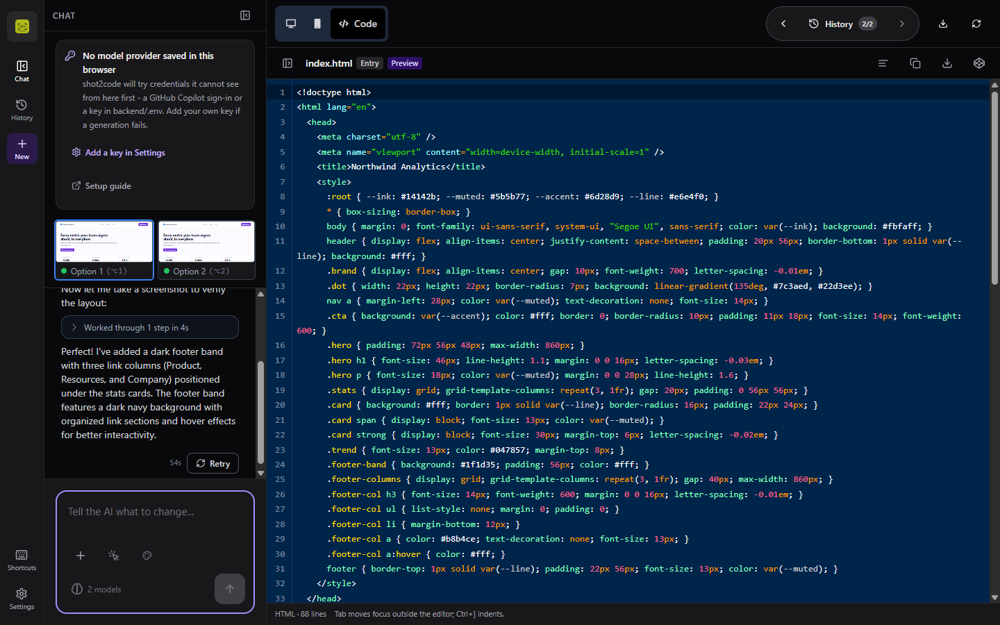
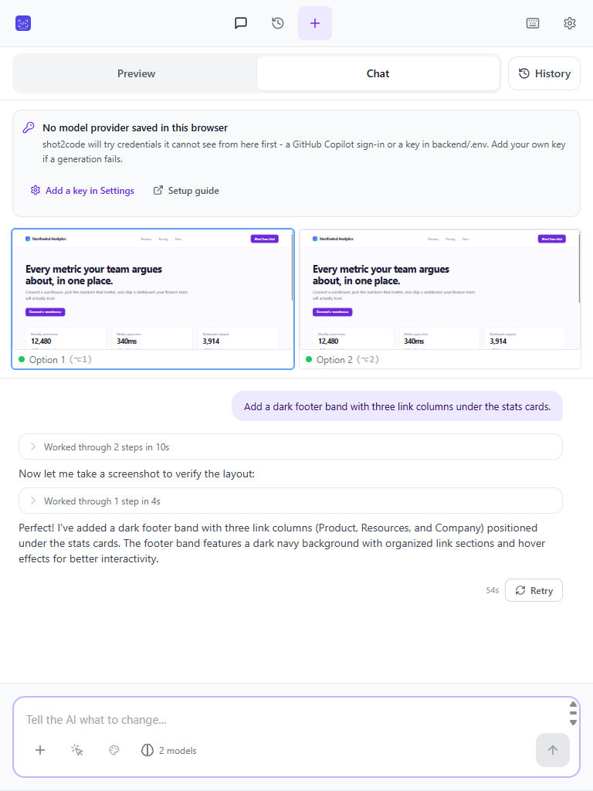
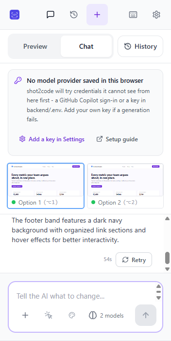

# shot2code

[](https://github.com/ArasaniRohithReddy/shot2code/releases/latest)
[](LICENSE)
[](#install)
[](CHANGELOG.md)

Turn screenshots, mockups, designs and screen recordings into clean, working
code — using AI, on your own machine.

shot2code is a **desktop app for Windows**. Everything runs locally: your
screenshots, your code and your API keys never leave your computer.

## Screenshots

<!-- Every image below has descriptive alt text; the summaries repeat the key
     detail so the gallery is usable without loading the images. -->

The workspace at 1920×1080 — chat, History and the centered desktop preview:


The Code workspace in the light and dark themes:

| Light | Dark |
|---|---|
|  |  |

The chat adapts down to narrow windows, so an edit is always one sentence away:

| Tablet width (768×1024) | Narrow window (352×700) |
|---|---|
|  |  |

<details>
<summary>The centered Preview and History controls at tablet width</summary>


</details>

## Install

**Requirements:** Windows 10 or 11, 64-bit (x64). The installer unpacks roughly
600 MB, because the Python backend and a headless Chromium ship with the app.
There are no macOS or Linux builds; on those platforms, run it
[from source](#running-from-source).

Download the latest build from
[Releases](https://github.com/ArasaniRohithReddy/shot2code/releases/latest):

| File | Use |
|---|---|
| `shot2code-<version>-x64.exe` | **Recommended.** Installer with shortcuts, and the only self-updating format |
| `shot2code-<version>-x64.msi` | Per-machine managed deployment; updates are administrator-controlled |
| `shot2code-<version>-x64.zip` | Portable — unzip and run `shot2code.exe` |

> **Windows will warn you.** The builds aren't code-signed, so you'll see
> *"Windows protected your PC"*. Click **More info → Run anyway**, or right-click
> the file → **Properties** → **Unblock** → **Apply**. See
> [Troubleshooting](Troubleshooting.md).

Because there is no signature to check, verify the download instead. Published
SHA-256 checksums live in [`docs/releases/`](docs/releases/) —
[v0.3.2](docs/releases/v0.3.2/SHA256SUMS.txt),
[v0.3.1](docs/releases/v0.3.1/SHA256SUMS.txt) and
[v0.3.0](docs/releases/v0.3.0/SHA256SUMS.txt):

```powershell
Get-FileHash .\shot2code-0.3.1-x64.exe -Algorithm SHA256
```

First launch takes about a minute while the bundled backend starts. Later
launches are quicker.

NSIS-installed builds check GitHub Releases automatically. Settings shows the
running version, update status, download progress, **Check now**, and
**Restart & install** when an update is ready. Updates install silently after
the backend, Copilot CLI and Chromium process tree has fully stopped — and if
that shutdown can't be confirmed, the install is aborted and stays retryable
rather than replacing a running app. MSI installs are per-machine and leave
upgrades to the administrator.

What changed in each release: [CHANGELOG.md](CHANGELOG.md).

## Using it

Give shot2code a screenshot, several related screenshots, a URL, a text
description, or a screen recording, and it generates a working page. It
produces several variants in parallel so you can pick the best one, then refine
it by describing what to change.

Supported output stacks:

- HTML + Tailwind
- HTML + CSS
- React + Tailwind
- Vue + Tailwind
- Bootstrap
- Ionic + Tailwind
- Alpine.js + Tailwind
- Preact + Tailwind
- Tailwind + daisyUI
- Bulma
- Material 3
- htmx + Tailwind

Other things it can do:

- **Select an element and edit it** by describing the change
- **History** — every generation is a commit you can step back through, and
  retried versions keep a link to the version they re-roll. Open it from the
  **History** button in the preview toolbar, the app rail, the tablet/mobile
  header, or with **Ctrl+4**.
- **Projects are saved on your machine** — a local SQLite database
  (`history.sqlite3` under `%LOCALAPPDATA%\shot2code\`) keeps your projects,
  versions and prompts, so **Recent projects** can pick up where you left off.
  Deleting a project removes it and its versions from the device.
- **Screenshot preview** — the agent renders its own output in a headless
  browser and visually checks its work
- **Asset extraction** — reuses the real logos and images from your screenshot
  (needs a Gemini key)
- **Image generation and editing** (needs a Replicate key)
- **Existing-project import** — choose a folder, ZIP, or source files, review
  the detected stack and safe file counts, then use the result as compact design
  context or hand the normalized files to the editable project workflow.
- **Multi-screenshot modes** — choose whether screenshots are separate pages,
  responsive views, UI states, or supporting references. Separate pages is the
  default, and every screenshot must be represented.
- **Project export** — generated single-page output uses an explicit Vite
  strategy for every supported stack, while multi-file source projects are
  preserved without inventing unsafe framework scaffolds.
- **A workspace you can quiet down** — collapse the chat panel to give the
  preview or the editor the full window, and reformat an HTML, CSS, JavaScript
  or JSON file with the **Format** action, which only ever changes whitespace.

### Keyboard shortcuts

Press **Ctrl+/** or use the keyboard button in the app rail to open the complete
shortcut reference. Project actions use conflict-free Ctrl+Alt combinations:
**Ctrl+Alt+N** starts a project, **Ctrl+Alt+I** opens Import,
**Ctrl+Alt+U** opens Upload, **Ctrl+Alt+S** opens Settings, and
**Ctrl+Alt+E** exports the current project. Use **Ctrl+1–4** for Preview, Code,
Chat, and History, and **Ctrl+Shift+Enter** to retry an AI-generated version.
On wide windows, pressing **Ctrl+3** again collapses the chat panel, and
**Ctrl+1** or **Ctrl+4** bring it back. Navigation shortcuts pause while typing
or while a dialog is open. In the code editor, Tab moves focus out and
**Ctrl+]** indents.

### Preview and CodePen

The file tree in the Code tab is always the authoritative project source. The
in-app preview is a derived, self-contained HTML artifact: browser-ready local
CSS, JavaScript, images, SVGs and encoded fonts are embedded when possible. If
a framework build or local asset cannot be represented safely, the preview
shows a deterministic fallback/diagnostic while leaving every source file
available for editing and project download. Generated preview documents run in
an opaque-origin sandbox with a restrictive CSP; select-and-edit communicates
through validated, per-preview messages instead of direct parent-window access.

The preview renders a fixed-width canvas — 1366px for desktop, 375px for mobile
— centred on a neutral backdrop so a wide window never leaves a misleading blank
strip beside it. **Fit** scales the desktop canvas down to the window (the
button shows the current percentage) and **100%** keeps it at its original size,
scrolling instead of clipping. Below 640px the canvas always fits, because a
1366px page at 100% cannot be read on a phone.

CodePen sharing is available only when the selected stack can run honestly in a
browser-only Pen. The app splits document head, HTML, CSS and JavaScript, keeps
module/defer/nomodule/import-map ordering where CodePen externals cannot express
it, and never guesses missing framework resources. Sharing always asks first
because code leaves the device and public Pens may be visible to others. For
build-dependent projects, use **Project folder** download instead.

### Export formats

Single-HTML exports keep the generated document intact, pin the working Babel
runtime, and bundle downloaded images/fonts under `assets/`. Project exports
use the following explicit strategies:

| Stack | Single HTML | Project folder |
|---|---|---|
| `html_tailwind` | Standalone HTML + Tailwind CDN | Vite HTML with safe `styles.css` / `script.js` extraction |
| `html_css` | Standalone HTML/CSS/JS | Vite HTML with safe `styles.css` / `script.js` extraction |
| `react_tailwind` | React UMD + pinned Babel + Tailwind CDN | Vite React when one canonical Babel block is safely transformable; otherwise documented Vite HTML fallback |
| `bootstrap` | Standalone HTML + Bootstrap CDN | Vite HTML retaining Bootstrap resources and order |
| `vue_tailwind` | Vue global build + Tailwind CDN | Documented Vite HTML using the working global-build app; no fake SFC extraction |
| `ionic_tailwind` | Pinned Ionic 8 ESM/styles + Tailwind CDN | Vite HTML retaining the supported Ionic module and stylesheet without the broken nomodule URL |
| `alpine_tailwind` | Alpine + Tailwind CDN | Vite HTML retaining directives and deferred runtime |
| `preact_tailwind` | Preact/HTM ESM + Tailwind CDN | Vite Preact with npm imports when canonical ESM is safely transformable; otherwise documented Vite HTML fallback |
| `tailwind_daisyui` | Tailwind + daisyUI CDNs | Vite HTML retaining matched Tailwind/daisyUI resources |
| `bulma` | Standalone HTML + Bulma CDN | Vite HTML retaining the pinned Bulma stylesheet |
| `material_web` | Pinned Material Web ESM + Material Symbols | Vite HTML retaining external modules, font stylesheet, and import order |
| `htmx_tailwind` | htmx + Tailwind CDNs | Vite HTML retaining htmx behavior and runtime order |

Generated HTML/CDN projects use Vite for local development and a deterministic
static-copy production build, so external inline modules are not accidentally
rebundled or reordered. React and Preact transformations use Vite's framework
build path. Downloaded assets and classic `script.js` are copied into `dist/`;
inline modules, import maps, special script/style types, and ambiguous multi-block
resources stay in `index.html` rather than being moved unsafely.

When the editor sends a multi-file project, export treats that source tree and
its declared entry point as authoritative, even if the preview used a composed
HTML fallback. Existing package and framework configuration is preserved. If no
valid root `package.json` build command is present, export keeps every source
file and adds a **Safe fallback** note instead of generating a plausible but
potentially broken scaffold. Downloaded image/font references are rewritten
relative to each referencing file without changing module or script order.

### Multiple screenshots

When more than one screenshot is uploaded, shot2code asks how they relate:

| Mode | Behaviour |
|---|---|
| Separate pages | One navigable route/view per screenshot; none may be omitted |
| Responsive views | One page, with breakpoints inferred from the screenshots |
| UI states | One interface with interactions that move between the states |
| Supporting references | Screenshot 1 is the target; the rest clarify details |

### Import an existing project

Open **Import → Folder, ZIP or source files** and choose a project folder, ZIP
archive, or selected source files. shot2code validates paths and size limits,
ignores dependency/build output, rejects unsafe or malformed input, and detects
the likely framework from package metadata, source files and CDN tags without
executing configuration or application code.

After inspection, choose **Use as design context** to persist only the bounded
`ProjectContext` summary, or **Open editable project** when the current editor
can consume the versioned normalized file payload. Raw source is held only for
the active editable-import handoff; it is never added to persisted project
context. The active context appears above every input tab and can be cleared.

## Choosing a model

You need **one** provider. GitHub Copilot is easiest because it needs no API key.

| Provider | Setup | Notes |
|---|---|---|
| **GitHub Copilot** ⭐ | `gh auth login` (or `copilot`) — needs an active Copilot subscription | Claude, GPT, Gemini and Grok through one sign-in |
| Gemini | API key | Also powers asset extraction and **video input** |
| Anthropic | API key | |
| OpenAI | API key | |
| Replicate | API key | Image generation, editing, background removal |

Keys go in **Settings** (gear icon) and are stored on your device only.
Replicate is the exception — it must be set in `backend/.env`.

### Picking which models generate

**Settings → Models** lists every provider you have credentials for, grouped by
provider, and the compact picker in the composer and edit toolbar shows the same
list. Tick the models you want: each generation produces **one option per
selected model**, up to the per-run limit (four for a new generation, two for an
edit or a video). Leave everything unchecked and shot2code chooses for you.

Copilot's list is discovered live from your plan; the API-key providers use a
validated list maintained with shot2code, so each entry is a model this app has
actually been run against. Superseded models are hidden behind **Show deprecated
models**, and a saved pick that can no longer run — a retired model, or one whose
key you removed — is flagged so you can clear it instead of silently losing an
option. Models that can't read images never appear, since turning a screenshot
into code requires image input, and video runs only offer models that can read a
recording.

### GitHub Copilot

shot2code uses the official
[GitHub Copilot SDK](https://github.com/github/copilot-sdk), which finds
credentials in this order:

1. A token in Settings
2. `COPILOT_GITHUB_TOKEN` / `GH_TOKEN` / `GITHUB_TOKEN`
3. A stored `copilot` CLI login
4. A stored `gh auth login`

So if you already use the GitHub CLI, it just works — Settings shows which
account was picked up. Otherwise create a fine-grained token with the
**Copilot Requests** permission.

## Running from source

Requires [uv](https://docs.astral.sh/uv/), [pnpm](https://pnpm.io/) and Node 18+.

```bash
# Backend
cd backend
uv sync
uv run playwright install chromium      # optional: screenshot preview
uv run uvicorn main:app --reload --port 7001

# Frontend (in another terminal)
cd frontend
pnpm install
pnpm dev
```

Open http://localhost:5173.

On macOS/Linux, `bash scripts/install.sh` installs everything in one go.

### Docker

```bash
echo "GEMINI_API_KEY=your-key" > .env
docker-compose up -d --build
```

For a much smaller image without the screenshot-preview tool:

```bash
docker build --build-arg INSTALL_CHROMIUM=false -t shot2code-backend ./backend
```

### Building the desktop app

Windows 10/11 x64, PowerShell, from the repository root:

```powershell
# Renderer
cd frontend
pnpm install
pnpm build
cd ..

# Backend, frozen with PyInstaller
cd backend
uv sync
uv run pyinstaller shot2code-backend.spec --noconfirm --distpath dist-pyinstaller

# Only the headless shell: the app always launches headless
$env:PLAYWRIGHT_BROWSERS_PATH = "$PWD\dist-pyinstaller\shot2code-backend\ms-playwright"
uv run playwright install chromium-headless-shell
Remove-Item Env:\PLAYWRIGHT_BROWSERS_PATH
cd ..

# Stage the payloads electron-builder expects
Remove-Item -Recurse -Force desktop\renderer, desktop\backend-dist -ErrorAction SilentlyContinue
Copy-Item -Recurse frontend\dist desktop\renderer
Copy-Item -Recurse backend\dist-pyinstaller\shot2code-backend desktop\backend-dist

# Installers -> desktop\dist
cd desktop
npm install
npx electron-builder --win nsis msi zip --publish never
```

That produces the NSIS `.exe` and its `.exe.blockmap`, `latest.yml`, the `.msi`
and the portable `.zip` in `desktop/dist`.

Pushing a `v*` tag runs a GitHub Actions workflow that builds all three formats
to prove packaging still works — it deliberately **never publishes**. Releases
are cut from a locally verified build; see
[docs/RELEASING.md](docs/RELEASING.md).

## Documentation

- [Changelog](CHANGELOG.md) — what changed in each release
- [Troubleshooting](Troubleshooting.md) — install warnings, blank windows, sign-in
- [Support](SUPPORT.md) — where to ask, and what to include in a report
- [Security](SECURITY.md) — reporting vulnerabilities, API keys, unsigned
  binaries, update integrity, and how imported code is handled
- [Contributing](CONTRIBUTING.md) — setup, tests, and pull request conventions
- [Code of Conduct](CODE_OF_CONDUCT.md)
- [Testing](TESTING.md) — how to run tests and type checks
- [Releasing](docs/RELEASING.md) — versioning, artifacts, and the publish sequence
- [Checksums](docs/releases/) — SHA-256 hashes for published downloads
- [Evaluation](Evaluation.md) — comparing models and prompts
- [design-docs/](design-docs/) — how the agent, variants and history work
- [AGENTS.md](AGENTS.md) — conventions for working in this repo

## Architecture

A React + Vite frontend and a FastAPI backend. Generation streams over a
WebSocket; everything else is plain HTTP. In the desktop app, Electron starts
the backend on a free local port and passes the URL to the UI.

The backend runs an agent loop: the model calls tools (`create_file`,
`edit_file`, `extract_assets`, `screenshot_preview`, image tools) and shot2code
executes them and feeds results back. Providers live in
`backend/agent/providers/`.

## Contributing

Issues and pull requests are welcome. Start with
[CONTRIBUTING.md](CONTRIBUTING.md) for setup and the exact test commands, and
[AGENTS.md](AGENTS.md) for the conventions and the non-obvious traps. Please
report security problems privately — see [SECURITY.md](SECURITY.md).

## License

MIT — see [LICENSE](LICENSE).
