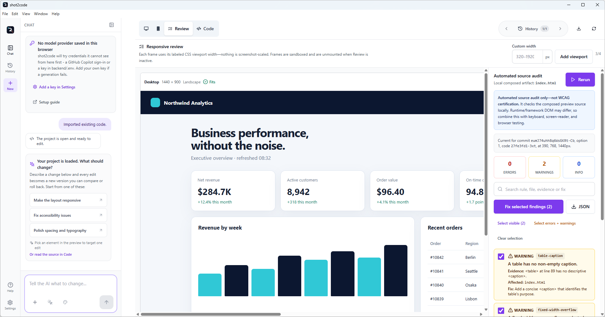
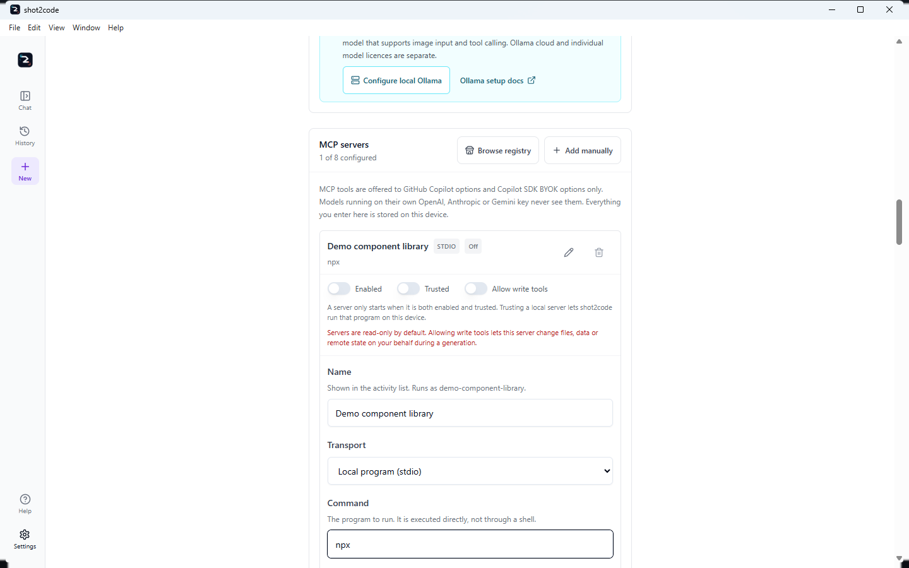
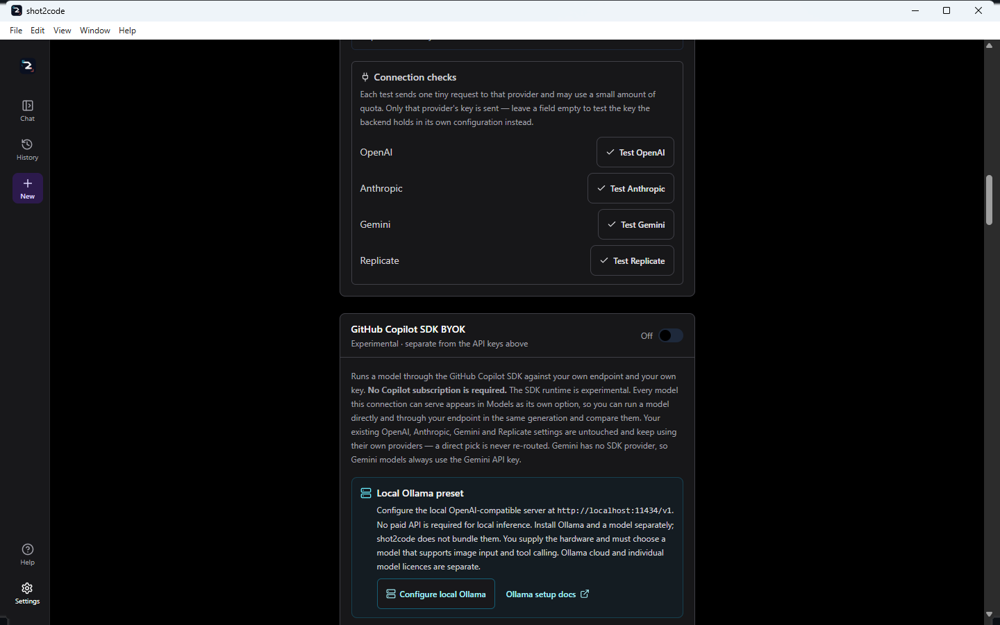
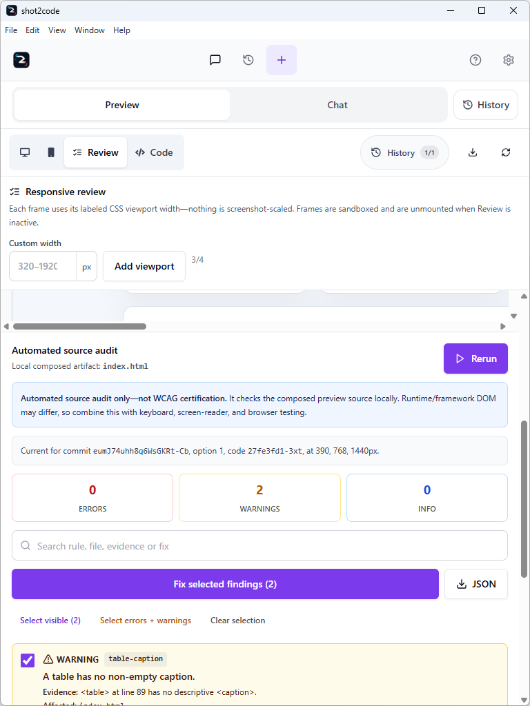

# shot2code

[](https://github.com/ArasaniRohithReddy/shot2code/releases/latest)
[](LICENSE)
[](#install)
[](CHANGELOG.md)

Turn screenshots, public websites, written briefs, existing code, Figma/Stitch
designs and GitHub frontends into editable web projects — on your own machine.

shot2code is a **desktop app for Windows**. The app, project history and
credentials live on your machine; generation data goes only to the model
provider or endpoint you explicitly select, and MCP tools run only through
servers you explicitly enable and trust.

## Seven ways to start

<!-- Every image below has descriptive alt text; the summaries repeat the key
     detail so the gallery is usable without loading the images. -->

The packaged v0.6.0 app has seven focused input tabs. See the
[detailed input-tab guide](docs/INPUT-TABS.md) for prerequisites, limits,
privacy boundaries, and the result each path creates.

| Upload | URL |
| --- | --- |
|  |  |
| Screenshots, related screens, exported SVG, or one short video. | Inspect a public site's design locally, or capture it through ScreenshotOne. |

| Text | Import |
| --- | --- |
|  |  |
| Generate from a written brief and optional saved design system. | Paste HTML or safely inspect a folder, ZIP, or selected source files. |

| Figma | GitHub |
| --- | --- |
|  |  |
| Render selected frames and preserve image fills/export-marked nodes through scoped REST access. | Open a public or explicitly authorized private frontend without executing repository code. |

| Stitch |
| --- |
|  |
| Open Stitch's localized project directly, or explicitly convert it through selected models. |

The URL and GitHub paths also produce useful local-first outcomes without a
code-generation provider:

| Website design inspection | Imported GitHub project |
| --- | --- |
|  |  |
| Copy/download `DESIGN.md`, or use it with desktop, tablet, and mobile screenshots. | Continue in Preview, Code, Review, Chat, History, and export. |

## What happens after an input

The current Review workspace renders the synthetic Northwind Analytics project
at real CSS widths and audits its composed source locally:



Current integration settings in the light and dark themes:

| MCP trust and write controls | Copilot SDK BYOK |
|---|---|
|  |  |

At 768×1024, Review becomes a single-column workspace while keeping Preview,
Chat and History as separate destinations:



## Install

**Requirements:** Windows 10 or 11, 64-bit (x64). The installer unpacks roughly
600 MB, because the Python backend and a headless Chromium ship with the app.
There are no macOS or Linux builds; on those platforms, run it
[from source](#running-from-source).

Download the latest build from
[Releases](https://github.com/ArasaniRohithReddy/shot2code/releases/latest):

| File | Use |
|---|---|
| `shot2code-<version>-x64.exe` | **Recommended.** Installer with shortcuts, and the only self-updating format |
| `shot2code-<version>-x64.msi` | Per-machine managed deployment; updates are administrator-controlled |
| `shot2code-<version>-x64.zip` | Portable — unzip and run `shot2code.exe` |

> **Windows will warn you.** The builds aren't code-signed, so you'll see
> *"Windows protected your PC"*. Click **More info → Run anyway**, or right-click
> the file → **Properties** → **Unblock** → **Apply**. See
> [Troubleshooting](Troubleshooting.md).

Because there is no signature to check, verify the download instead. Published
SHA-256 checksums live in [`docs/releases/`](docs/releases/) —
[v0.6.0](docs/releases/v0.6.0/SHA256SUMS.txt),
[v0.5.2](docs/releases/v0.5.2/SHA256SUMS.txt),
[v0.5.0](docs/releases/v0.5.0/SHA256SUMS.txt),
[v0.4.0](docs/releases/v0.4.0/SHA256SUMS.txt),
[v0.3.3](docs/releases/v0.3.3/SHA256SUMS.txt),
[v0.3.2](docs/releases/v0.3.2/SHA256SUMS.txt),
[v0.3.1](docs/releases/v0.3.1/SHA256SUMS.txt) and
[v0.3.0](docs/releases/v0.3.0/SHA256SUMS.txt):

```powershell
Get-FileHash .\shot2code-0.6.0-x64.exe -Algorithm SHA256
```

First launch takes about a minute while the bundled backend starts. Later
launches are quicker.

NSIS-installed builds check GitHub Releases automatically. Settings shows the
running version, update status, download progress, **Check now**, and
**Restart & install** when an update is ready. Updates install silently after
the backend, Copilot CLI and Chromium process tree has fully stopped — and if
that shutdown can't be confirmed, the install is aborted and stays retryable
rather than replacing a running app. MSI installs are per-machine and leave
upgrades to the administrator.

What changed in each release: [CHANGELOG.md](CHANGELOG.md).

## Using it

Give shot2code a screenshot, several related screenshots, a public website,
a Figma/Stitch design, a GitHub frontend repository, a text description, or a
screen recording, and it generates or opens a working project. It
produces several variants in parallel so you can pick the best one, then refine
it by describing what to change.

The [input-tab guide](docs/INPUT-TABS.md) explains Upload, URL, Text, Import,
Figma, GitHub, and Stitch step by step, including credentials, limits, privacy,
and what each path opens.

Supported output stacks:

- HTML + Tailwind
- HTML + CSS
- React + Tailwind
- Vue + Tailwind
- Bootstrap
- Ionic + Tailwind
- Alpine.js + Tailwind
- Preact + Tailwind
- Tailwind + daisyUI
- Bulma
- Material 3
- htmx + Tailwind

Other things it can do:

- **Select an element and edit it** by describing the change
- **History** — every generation is a commit you can step back through, and
  retried versions keep a link to the version they re-roll. Each version records
  the exact model/run identity, and Chat reconstructs both the user's prompts
  and the saved assistant responses for the selected branch. Open History from the
  **History** button in the preview toolbar, the app rail, the tablet/mobile
  header, or with **Ctrl+4**.
- **Projects are saved on your machine** — a local SQLite database
  (`history.sqlite3` under `%LOCALAPPDATA%\shot2code\`) keeps your projects,
  versions and prompts, so **Recent projects** can pick up where you left off.
  Installing an update reuses that same database, so old projects remain
  available. Deleting a project removes it and its versions from the device.
- **Screenshot preview** — the agent renders its own output in a headless
  browser and visually checks its work. Settings shows whether it is available
  and offers **Check again** after you install the browser, so you do not have
  to restart the app.
- **Responsive Review** — compare two to four real viewport widths at once,
  measure horizontal overflow, and run a deterministic local semantic and
  accessibility source audit. Filter/search findings, run a bounded no-tools AI
  review with the option's recorded model, and send selected fixes directly
  through Chat.
- **Design Inspector** — extract repeated colors, CSS variables, typography,
  spacing, radii, shadows, motion and component patterns from the composed
  preview, then download `DESIGN.md`, `SKILL.md`, or a palette PNG.
- **Public website → `DESIGN.md`** — inspect a public URL in the bundled local
  Chromium, capture desktop/tablet/mobile evidence, extract computed design
  tokens, semantic and accessibility structure, and public asset references,
  then copy/download the result or use it with the responsive screenshots for
  generation. Private and loopback destinations are refused.
- **MCP tools for Copilot runtimes** — connect bounded stdio, HTTP or SSE
  servers. A server must be enabled and trusted, stays read-only unless write
  tools are explicitly allowed, and is never exposed to native OpenAI,
  Anthropic or Gemini variants. Browse the official MCP Registry in Settings;
  Google Stitch is a featured reviewed template and is added disabled and
  untrusted. Figma MCP endpoints are filtered and existing entries are disabled
  because Figma accepts only clients listed in its MCP Catalog.
- **Agent Skills** — import a local skill folder or a public GitHub skill folder.
  Every skill is validated, stored locally, disabled until explicitly enabled,
  and available only to Copilot runtimes. Skill scripts are resources only:
  shot2code does not enable shell execution.
- **Figma import** — use a scoped personal access token with
  `file_content:read` to render Figma frames through the official REST API and
  preserve original image fills plus export-marked nodes as reusable local
  assets, or upload exported PNG/JPG/SVG files. Figma restricts both its
  desktop and hosted MCP servers to clients in the Figma MCP Catalog;
  shot2code does not advertise a connection Figma will reject. Figma REST does
  not provide production application source code, so the selected shot2code
  models still create the implementation.
- **Google Stitch** — the Windows desktop bundles the experimental,
  Apache-2.0 `@google/stitch-sdk` to generate or import Stitch screens with the
  user's API key. Its HTML, screenshot, referenced images, stylesheets, fonts
  and available `DESIGN.md` are localized into editable project files; the
  official hosted Stitch MCP remains available as a separately trusted server.
  Stitch is not described as a general image backend or guaranteed-free
  provider because its official SDK publishes neither capability. The dedicated
  Stitch tab defaults to **Stitch only**, which opens those files directly and
  calls no second model provider; **Convert to selected stack** is explicit.
- **GitHub repository import** — paste a public repository URL to inspect its
  text source, frontend stack, components, tokens and bounded image assets
  without executing any project code. Private repositories require a separate
  fine-grained token limited to that repository with `Contents: read`; the
  Copilot login is intentionally not reused for broader repository access.
- **Paste screenshots into Chat** — use Ctrl+V/Cmd+V in the refinement
  composer to attach PNG, JPEG or WebP references through the same bounded
  update-image flow as the plus button.
- **Asset extraction** — reuses the real logos and images from your screenshot
  (needs a Gemini key)
- **Image generation and editing** — Replicate by default, or optionally
  Cloudflare Workers AI or any OpenAI-compatible image endpoint. See
  [Image generation](#image-generation).
- **Existing-project import** — choose a folder, ZIP, or source files, review
  the detected stack and safe file counts, then use the result as compact design
  context or hand the normalized files to the editable project workflow.
- **Multi-screenshot modes** — choose whether screenshots are separate pages,
  responsive views, UI states, or supporting references. Separate pages is the
  default, and every screenshot must be represented.
- **Project export** — generated single-page output uses an explicit Vite
  strategy for every supported stack, while multi-file source projects are
  preserved without inventing unsafe framework scaffolds.
- **A workspace you can quiet down** — collapse the chat panel to give the
  preview or the editor the full window, and reformat an HTML, CSS, JavaScript
  or JSON file with the **Format** action, which only ever changes whitespace.
- **A workspace you can resize** — on wide windows (≥ 1280px), drag the divider
  between the chat and the preview, or between the file tree and the editor, to
  set how the width is shared. The dividers are focusable separators: arrow keys
  move them 16px at a time, **Shift** makes that 64px, **Home** and **End** jump
  to the narrowest and widest allowed widths, and **Enter** or a double-click
  restores the default. Widths are remembered per browser, are clamped so
  neither side becomes unusable, and are a view preference only — resizing never
  touches a project's versions, options, or history.
- **A workspace that reopens where you left it** — the desktop restores its
  validated on-screen bounds and maximized state, while the app restores the
  active saved project, selected version and file, Preview/Code/Review tab,
  HTML/Stack source, and desktop preview zoom. Transient generation state,
  dialogs, selections and credentials are not stored as workspace state.
- **In-app feedback** — Help → Feedback prepares a bug report, feature request
  or general feedback without attaching logs, source, history, prompts,
  screenshots or credentials. An authenticated GitHub CLI can submit directly;
  otherwise the same bounded report can be copied, saved as Markdown, or opened
  as a prefilled browser issue.

### Help

**Ctrl+/** or the **Help** button in the app rail opens the Help centre. It has
four sections: **Get started** (connect a model, then go from a screenshot to an
export), **Guides** (the published architecture, data-handling, security,
changelog, release and contributing documents), **Support** (FAQ,
troubleshooting, the issue tracker, and the source repository), and **Keyboard
shortcuts**. Every link opens in your browser and points at the
[shot2code product page](https://arasanirohithreddy.github.io/app-releases/shot2code/)
or its rendered
[documentation site](https://arasanirohithreddy.github.io/app-releases/shot2code/docs/).
In the desktop app, Support also offers **Open diagnostic logs**, which opens the
log the shell writes for backend startup, renderer crashes and console errors —
the first thing to attach to a bug report. The browser build has no log file and
says so rather than offering a dead button.

### Keyboard shortcuts

Every shortcut is listed in Help (**Ctrl+/**). Project actions use conflict-free
Ctrl+Alt combinations: **Ctrl+Alt+N** starts a project, **Ctrl+Alt+I** opens
Import, **Ctrl+Alt+U** opens Upload, **Ctrl+Alt+S** opens Settings, and
**Ctrl+Alt+E** exports the current project. Use **Ctrl+1–4** for Preview, Code,
Chat, and History, **Ctrl+Alt+C** to show or hide the Chat panel, and
**Ctrl+Shift+Enter** to retry an AI-generated version. On wide windows,
**Ctrl+Alt+C** collapses the chat panel, and **Ctrl+1** or **Ctrl+4** bring it
back. Navigation shortcuts pause while typing
or while a dialog is open. In the code editor, Tab moves focus out and
**Ctrl+]** indents. In the desktop app, use **Ctrl+=** or **Ctrl++** to zoom in,
**Ctrl+-** to zoom out, and **Ctrl+0** to reset; the numpad add and subtract
keys work with Ctrl as well.

### Application menu (desktop app)

The desktop app has a real menu bar rather than Electron's stock one, and every
item runs the same command the keyboard runs — the menu can never do something
the shortcut does not.

| Menu | Items |
| --- | --- |
| **File** | New project, Upload screenshots, Import project, Export current project, Settings, Exit |
| **Edit** | Undo, Redo, Cut, Copy, Paste, Delete, Select All |
| **View** | Preview, Code, Chat, History, Show Chat panel, Zoom In/Out/Actual Size, Toggle Full Screen |
| **Window** | Minimize, Close |
| **Help** | Help center, Keyboard shortcuts, Product page, Documentation (User guide), All releases, Report an issue, Open diagnostic logs, About shot2code |

Each item shows the accelerator published in Help, but deliberately does not
capture it: the keystroke stays with the page, so **Ctrl+Z** still drives
CodeMirror's own history, **Ctrl+/** still toggles a comment inside the editor,
and Ctrl+=/-/0 still run through the app's single zoom handler. Clicking a menu
item raises the window first, so a command works even when the window is
minimised or behind something. Items that need a project — Export and the
workspace views — are greyed out until one is open. **Reload** and **Toggle
Developer Tools** appear only in a development build, so a release cannot reload
the renderer out from under a running generation. Help links open in your
browser and point at the same published pages the Help centre uses.

### Preview and CodePen

The Code tab keeps the authoritative **Current code** view and adds an
**Export project** view. Export project is read-only and is produced by the
same stack-aware backend path as the downloaded ZIP, so users can inspect the
generated `package.json`, Vite configuration, framework entry files, styles,
scripts, README, and downloaded-asset manifest before exporting. Switching
views does not replace or modify the current source, selected file, or History.

The in-app preview keeps **HTML** as its default and adds a separate **Stack**
option. HTML renders the existing derived, self-contained artifact. Stack loads
the generated export files and safely projects the supported Vite HTML, React,
and Preact layouts back into the existing browser sandbox. It never runs
`npm`, package scripts, Vite configuration, imported project configuration, or
host filesystem code. Projects outside the controlled runtime shape receive an
explicit limited/unavailable diagnostic and can still use the original HTML
preview.

Browser-ready local CSS, JavaScript, images, SVGs and encoded fonts are embedded
when possible. Export-preview assets are bounded before being sent to the
renderer; oversized assets remain listed but are not embedded. If a framework
runtime or local asset cannot be represented safely, the preview shows a
deterministic fallback/diagnostic while leaving every source file available for
editing and project download. Generated preview documents run in an
opaque-origin sandbox with a restrictive CSP; select-and-edit communicates
through validated, per-preview messages instead of direct parent-window access.

The preview renders a fixed-width canvas — 1366px for desktop, 375px for mobile
— centred on a neutral backdrop so a wide window never leaves a misleading blank
strip beside it. The desktop canvas has its own zoom controls: **−** and **+**
step it in 10% increments between 25% and 200%, the percentage between them is a
live readout of what is on screen, **Fit** scales the canvas down to the window
and **100%** returns it to its original size. Zooming past the window pans the
canvas instead of clipping it, and the iframe stays fully interactive
throughout. Below 640px the canvas always fits, because a 1366px page at 100%
cannot be read on a phone.

CodePen sharing is available only when the selected stack can run honestly in a
browser-only Pen. The app splits document head, HTML, CSS and JavaScript, keeps
module/defer/nomodule/import-map ordering where CodePen externals cannot express
it, and never guesses missing framework resources. Sharing always asks first
because code leaves the device and public Pens may be visible to others. For
build-dependent projects, use **Project folder** download instead.

### Export formats

Single-HTML exports keep the generated document intact, pin the working Babel
runtime, and bundle downloaded images/fonts under `assets/`. Project exports
use the following explicit strategies. `POST /api/export/preview` exposes the
same bounded text-file projection and asset manifest used by the Code and Stack
preview controls; `POST /api/export` packages that projection as the ZIP.

| Stack | Single HTML | Project folder |
|---|---|---|
| `html_tailwind` | Standalone HTML + Tailwind CDN | Vite HTML with safe `styles.css` / `script.js` extraction |
| `html_css` | Standalone HTML/CSS/JS | Vite HTML with safe `styles.css` / `script.js` extraction |
| `react_tailwind` | React UMD + pinned Babel + Tailwind CDN | Vite React when one canonical Babel block is safely transformable; otherwise documented Vite HTML fallback |
| `bootstrap` | Standalone HTML + Bootstrap CDN | Vite HTML retaining Bootstrap resources and order |
| `vue_tailwind` | Vue global build + Tailwind CDN | Documented Vite HTML using the working global-build app; no fake SFC extraction |
| `ionic_tailwind` | Pinned Ionic 8 ESM/styles + Tailwind CDN | Vite HTML retaining the supported Ionic module and stylesheet without the broken nomodule URL |
| `alpine_tailwind` | Alpine + Tailwind CDN | Vite HTML retaining directives and deferred runtime |
| `preact_tailwind` | Preact/HTM ESM + Tailwind CDN | Vite Preact with npm imports when canonical ESM is safely transformable; otherwise documented Vite HTML fallback |
| `tailwind_daisyui` | Tailwind + daisyUI CDNs | Vite HTML retaining matched Tailwind/daisyUI resources |
| `bulma` | Standalone HTML + Bulma CDN | Vite HTML retaining the pinned Bulma stylesheet |
| `material_web` | Pinned Material Web ESM + Material Symbols | Vite HTML retaining external modules, font stylesheet, and import order |
| `htmx_tailwind` | htmx + Tailwind CDNs | Vite HTML retaining htmx behavior and runtime order |

Generated HTML/CDN projects use Vite for local development and a deterministic
static-copy production build, so external inline modules are not accidentally
rebundled or reordered. React and Preact transformations use Vite's framework
build path. Downloaded assets and classic `script.js` are copied into `dist/`;
inline modules, import maps, special script/style types, and ambiguous multi-block
resources stay in `index.html` rather than being moved unsafely.

When the editor sends a multi-file project, export treats that source tree and
its declared entry point as authoritative, even if the preview used a composed
HTML fallback. Existing package and framework configuration is preserved. If no
valid root `package.json` build command is present, export keeps every source
file and adds a **Safe fallback** note instead of generating a plausible but
potentially broken scaffold. Downloaded image/font references are rewritten
relative to each referencing file without changing module or script order.

### Multiple screenshots

When more than one screenshot is uploaded, shot2code asks how they relate:

| Mode | Behaviour |
|---|---|
| Separate pages | One navigable route/view per screenshot; none may be omitted |
| Responsive views | One page, with breakpoints inferred from the screenshots |
| UI states | One interface with interactions that move between the states |
| Supporting references | Screenshot 1 is the target; the rest clarify details |

### Import an existing project

Open **Import → Folder, ZIP or source files** and choose a project folder, ZIP
archive, or selected source files. shot2code validates paths and size limits,
ignores dependency/build output, rejects unsafe or malformed input, and detects
the likely framework from package metadata, source files and CDN tags without
executing configuration or application code.

After inspection, choose **Use as design context** to persist only the bounded
`ProjectContext` summary, or **Open editable project** when the current editor
can consume the versioned normalized file payload. Raw source is held only for
the active editable-import handoff; it is never added to persisted project
context. The active context appears above every input tab and can be cleared.

## Choosing a model

You need **one** provider. GitHub Copilot is easiest because it needs no API key.

| Provider | Setup | Notes |
|---|---|---|
| **GitHub Copilot** ⭐ | **Sign in with GitHub** in Settings, or `gh auth login` / `copilot` — needs an active Copilot subscription | Claude, GPT, Gemini and Grok through one sign-in |
| **Copilot SDK BYOK** | One OpenAI-compatible, Azure OpenAI or Anthropic endpoint and its own credential | No Copilot subscription required; appears as a separate model group and never re-routes a native provider |
| Gemini | API key | Also powers asset extraction and **video input** |
| Anthropic | API key | |
| OpenAI | API key | |
| Replicate | API key | Default image backend; also the only backend for background removal |
| Cloudflare Workers AI | Account ID + API token | *Optional* alternative image backend — see [Image generation](#image-generation) |
| ScreenshotOne | API key | Captures public URLs; the URL tab can test the key with one minimal request |
| Figma | Scoped personal access token | Imports selected frames through the documented REST API; Figma MCP accepts only catalog-listed clients |
| Google Stitch | Stitch API key or MCP | Desktop SDK generation/import with localized code/assets; experimental Google Labs package, not a general image provider |
| GitHub repository import | None for public repos; optional repository-limited token for private repos | Fine-grained token with `Contents: read`; never borrowed from Copilot sign-in |

Keys go in **Settings** (gear icon) and are stored on your device only.
Every key is masked in the UI and is never echoed back by a diagnostic, a
validation response, a log line, project history or an exported report.
Capture-only Figma, Stitch, GitHub-repository and ScreenshotOne credentials are
removed before a model-generation request is built.

### Checking a provider before you generate

Settings can test each provider individually instead of making you find out
mid-generation. A check makes **one minimal but real request** — deliberately
tiny, though the account may still be billed a negligible amount for it — and
reports what came back in plain terms: ready, credentials, billing, quota,
permissions, model, network or configuration. An OpenAI account with no credit
left, for example, is reported as a billing problem with "add credits", not as
an unexplained failure. Replicate is checked against its account endpoint
rather than by running a prediction.

A check uses the key in that request when you supply one, otherwise the key the
backend was started with. **A custom OpenAI base URL must carry its own key in
the same request**: the key configured on the server belongs to the server's own
endpoint and is never sent to an address a request names. Caller-supplied URLs
are held to the same rules as a BYOK endpoint — `http`/`https` only, no
credentials embedded in the URL, and HTTPS unless the host is loopback.

### Image generation

Placeholder images are generated by a provider **you** pay directly; shot2code
adds nothing and ships no images of its own. **Settings → Image Generation**
picks the backend:

| Provider | Credential | Cost |
|---|---|---|
| **Replicate** (default) | API key | Billed by [Replicate](https://replicate.com/pricing), which charges only for what you use; a public model's cost depends on the model and how long each run takes, and is listed on that model's own page. No free allocation. |
| Cloudflare Workers AI | Account ID + API token | Billed to your Cloudflare account. [Cloudflare's published pricing](https://developers.cloudflare.com/workers-ai/platform/pricing/) (checked 2026-09-17) includes a daily free allocation of **10,000 Neurons on both the Workers Free and Workers Paid plans**, resetting at 00:00 UTC. Going beyond it requires the Workers Paid plan and is billed at $0.011 per 1,000 Neurons; `flux-1-schnell` is priced at 4.80 neurons per 512×512 tile plus 9.60 per step, and shot2code requests 4 steps. The allocation, the rates and model availability are set by Cloudflare and can change; some models require a paid billing method. |
| OpenAI-compatible endpoint | Base URL, plus an API key unless it is on localhost | Billed by whoever runs the endpoint. |

No provider here is free forever, and shot2code does not claim otherwise: every
allowance above belongs to the provider, is scoped to a period, and can change.
Figures are quoted from the provider's own page with the date they were read.

The alternatives are **additive**. Picking one never reads, replaces or
re-routes your Replicate, OpenAI, Anthropic or Gemini key, and Replicate keeps
working exactly as before.

**Models.** Replicate offers `prunaai/z-image-turbo` (default) and
`black-forest-labs/flux-2-klein-4b`; Workers AI offers
`@cf/black-forest-labs/flux-1-schnell`. Those are the models shot2code builds
request bodies for, and they do not share an input schema — which is why a
model outside the list is not simply offered. You can still use **another
Replicate model**: enter its id and press *Check this model*, and shot2code
reads that model's own OpenAPI schema from Replicate and accepts it only if it
really declares a string `prompt` input and an image output. Only the prompt is
sent, so a model needing other required inputs is refused rather than run and
hoped for.

**Background removal stays on Replicate.** No other provider here has an
equivalent endpoint, and none is substituted: without a Replicate key the
`remove_backgrounds` tool is simply not offered. Image *editing* runs on
Replicate, or on an OpenAI-compatible endpoint when you have explicitly chosen
one and it implements `/images/edits`.

**When generation fails, it says so.** Each prompt reports its own outcome, so
a partially successful batch reads "Generated 2 of 5 images" rather than
claiming five, and a batch that produced nothing is reported as a failure with
the reason — rate limited, out of credit, bad credentials, timed out — and what
to do about it. No blank tiles, no empty URLs.

### Free image search (shot2code sends no key)

Sometimes a design needs a real photograph rather than an invented one, and
sometimes there is no image-generation credential at all. **Settings → Free
image search** adds a `search_free_images` tool that finds ready-to-use
photographs through [Openverse](https://openverse.org/).

shot2code sends no API key and no credential. Openverse's image search
currently answers anonymous requests within the rate limits it publishes —
around 20 requests a minute and 200 a day per machine (checked 2026-09-27).
Those limits, and keyless access itself, are set by Openverse and can change;
see the [Openverse terms](https://openverse.org/terms) and
[API documentation](https://api.openverse.org/v1/).

It is a *separate* tool from `generate_images`, never a silent fallback inside
it: the model picks whichever the design needs, and the activity feed says
"Found 3 free images" rather than "Generated", so the two are never confused.
It works with no image provider configured at all, and configuring one does not
switch it off.

**Only CC0 and Public Domain Mark results are returned.** Every other Creative
Commons licence carries an obligation an exported project would silently
inherit — attribution that must follow the image everywhere it appears,
share-alike that spreads to the work it is combined with, non-commercial that
forbids shipping, no-derivatives that forbids cropping. shot2code cannot
enforce those inside your codebase, so it does not hand you images that need
them. Each result still arrives with its title, creator, source page, provider,
licence name and licence URL so you can credit it if you want to.

> Openverse aggregates licence metadata from other platforms and can be wrong.
> Before using any of these images commercially, open the source page and
> confirm the licence and the creator yourself.

Images are **downloaded and served locally**, so a generated or exported
project never links to somebody else's server. Every downloaded URL is checked
first: `http(s)` only, DNS-resolved and refused if it points at a private,
loopback or cloud-metadata address, redirects re-validated rather than
followed, content type checked against the actual bytes, and byte and pixel
ceilings enforced. Your query text goes to `api.openverse.org`; at most four
images per search, three searches per turn and ten per generation.

Web image search is deliberately *not* used for this. A picture on a web page
grants no reuse right, and presenting one as usable would be the most damaging
thing this feature could do.


### Picking which models generate

**Settings → Models** lists every provider you have credentials for, grouped by
provider, and the compact picker in the composer and edit toolbar shows the same
list. Tick the models you want: each generation produces **one option per
selected model**, up to the per-run limit (four for a new generation, two for an
edit or a video). Leave everything unchecked and shot2code chooses for you.

Copilot's list is discovered live from your plan; the API-key providers use a
validated list maintained with shot2code, so each entry is a model this app has
actually been run against. Superseded models are hidden behind **Show deprecated
models**, and a saved pick that can no longer run — a retired model, or one whose
key you removed — is flagged so you can clear it instead of silently losing an
option. Models that can't read images never appear, since turning a screenshot
into code requires image input, and video runs only offer models that can read a
recording.

### GitHub Copilot

shot2code uses the official
[GitHub Copilot SDK](https://github.com/github/copilot-sdk), which finds
credentials in this order:

1. A token in Settings
2. `COPILOT_GITHUB_TOKEN` / `GH_TOKEN` / `GITHUB_TOKEN`
3. A stored `copilot` CLI login
4. A stored `gh auth login`

So if you already use the GitHub CLI, it just works — Settings shows which
account was picked up. Otherwise create a fine-grained token with the
**Copilot Requests** permission.

**Sign in with GitHub** in the Windows desktop uses shot2code's registered OAuth
device flow. GitHub opens in the system browser, the one-time code is shown in
Settings, and expiring access/refresh tokens are encrypted with Electron
`safeStorage`. No client secret ships in the app. The backend is restarted on
the same local port with the refreshed token, so it never needs to be written
to browser storage. Source/browser builds retain the official `copilot login`
or `gh auth login` fallback and the optional token field.

**Disconnect GitHub from shot2code** removes only shot2code's encrypted OAuth
credential and stops reuse of the local CLI session for this browser. It never
signs the user out of GitHub CLI or Copilot CLI globally.

### GitHub Copilot SDK BYOK

**Settings → GitHub Copilot SDK BYOK** adds one endpoint of your own through the
Copilot SDK. It supports any standards-compatible OpenAI-style server, Azure
OpenAI and Anthropic. The connection has its own API key or bearer token, and
direct OpenAI/Anthropic credentials are never borrowed for it. An
OpenAI-compatible endpoint on `localhost` may be credentialless; every other
endpoint needs its own. Base URLs must be `https` unless they point at loopback,
and may not embed credentials. The SDK has no native Gemini BYOK provider.

**Finding the models.** For an OpenAI-compatible connection, **Validate** asks
the endpoint what it serves at `/models` and lists what comes back (bounded, and
only ids it could actually select). Select several discovered ids to publish
separate BYOK options in one run. That route is optional in practice: if the
endpoint does not implement it, shot2code says so and you add model names by
hand. Azure OpenAI and Anthropic do not expose an equivalent list. A listing
that fails for a real reason is reported; no model list is invented.

**Wire API.** Chat Completions is what every compatible endpoint implements, so
a connection with its own base URL defaults to it; a vendor connection with no
base URL of its own defaults to Responses. Either can be chosen explicitly.

**Your own models.** Add one or more model/deployment names and each is offered
under its real name — shot2code does not list a whole vendor family for a custom
endpoint. Each identity is
`sdk-byok/<provider>/custom/<model>`, URL-encoded so a slash, colon or `@` in the
name stays intact and can never collide with a catalog id. Model names are
bounded to 128 characters. Internally the run borrows a neutral, non-reasoning
template so the SDK knows how to shape the conversation, and **no GPT or Claude
thinking level is sent** to a model that has no such concept — only the real
model name goes on the wire.

**What the model must support.** shot2code drives a model with screenshots and
tool calls, so a BYOK model needs **image input (vision) and tool calling**. A
successful check says the endpoint answered; it cannot prove those two
capabilities, so the requirement is repeated with the result, and an endpoint
that rejects a tool or an image is reported as a model problem rather than a
mystery.

BYOK is additive. Models appear under **Copilot SDK (BYOK)** with identities
such as `sdk-byok/azure/gpt-5.6-sol (high thinking)` for a catalog model, or
`sdk-byok/openai/custom/your-model` for your own. A native model and its BYOK
twin can be selected in the same generation and remain distinct in History and
retries; a retry replays the identity while using whatever the connection is
configured with today. Direct OpenAI, Anthropic, Gemini, Replicate and
Copilot-subscription credentials and routing are unchanged.

### MCP servers

Settings accepts up to eight MCP servers over stdio, HTTP or SSE. Local servers
are spawned directly from an argument vector, never through a shell; remote
servers require HTTPS except on localhost. A server must be both **Enabled**
and **Trusted** before a Copilot subscription or SDK-BYOK option can use it.
Tools are read-only by default, and **Allow write tools** is a separate,
explicit permission. Native OpenAI, Anthropic and Gemini variants never receive
MCP tools.

Environment values and request headers are masked and excluded from History,
logs, validation responses and Review reports. Disabled, untrusted or
incomplete drafts are reported as notices and do not block direct generations.
The built-in Registry browser lists bounded HTTPS remote entries from the
official Model Context Protocol Registry. Installing an entry never activates
it: the user must still review it and separately enable and trust it.

### Web search

Off by default. When switched on, Settings adds a shot2code-owned `search_web`
tool to **every** selected model — OpenAI, Anthropic, Gemini, GitHub Copilot
and Copilot SDK BYOK alike — so a run can look up current documentation, APIs
or brand details regardless of which provider it happens to use.

[Tavily](https://docs.tavily.com/) is the default provider. Its published plan
includes 1,000 API credits a month, reset on the first of each month, with no
credit card required; a basic search costs one credit and shot2code never asks
for the two-credit advanced mode. Tavily also documents a
[keyless trial](https://docs.tavily.com/documentation/keyless) that needs no
account at all, rate-limited and shared with every other keyless user.
[Exa](https://exa.ai/) is available as an alternative: it is pay-as-you-go with
no subscription, its published free tier gives $10 of credits at sign-up and
resets to $10 on the first of each month with no payment method required, and
search is billed at $7 per 1,000 requests for up to 10 results (shot2code asks
for at most five). Exa has no keyless mode and always needs a key. A
`TAVILY_API_KEY` or `EXA_API_KEY` in `backend/.env` is used when Settings has no
key for the chosen provider.

These allowances are the providers' own, depend on your account, and can change
at any time — shot2code states them and links the source, it does not promise
them. Check
[Tavily credits & pricing](https://docs.tavily.com/documentation/api-credits)
and [Exa pricing](https://exa.ai/docs/admin/pricing) before relying on either.

What leaves the device is the query the model writes, sent only to that
provider's fixed HTTPS endpoint. Screenshots, prompt text and generated code
are never sent, no page is fetched, and redirects are not followed. Each search
returns at most five results with bounded titles, snippets and total size, is
capped at three searches per turn and ten per generation, and carries an
explicit untrusted-content warning: results are reference material, never
instructions. The model may restrict a search to up to ten hostnames, and that
allowlist is re-applied locally as well as at the provider.

The search-provider key is backend-only: it is read from Settings at send time
and never written into project History, a commit snapshot or a tool argument.
**Test connection** runs one real search — and spends one provider credit — so
a wrong key is reported before a generation discovers it.

Copilot's own built-in web search stays available under **Copilot web
research** for people who prefer it and have the entitlement. Only one search
tool is enabled per session: when the canonical search is usable it is used
instead of the built-in.

#### Why page fetching is not offered

Copilot's runtime also ships a built-in `web_fetch` that opens a URL and
returns the whole page. shot2code does not offer it, and that is a decision
about what can be controlled rather than a preference:

- **Its output cannot be bounded.** A built-in tool's result is produced inside
  the Copilot runtime and handed to the model by the runtime. The SDK exposes
  it to an application only as an after-the-fact notification, so there is no
  point at which shot2code could truncate that text, prefix it with an
  untrusted-content warning, or count it against a budget. An entire
  third-party page would enter the model's context unchecked — exactly the
  unbounded route `search_web` exists to avoid.
- **A session cannot be scoped to a set of URLs.** The runtime protocol does
  describe an allowed-URL configuration, but the SDK's session-creation API
  takes no parameter for it, so "this run may read docs.example.com" cannot be
  expressed.
- **A built-in call is not counted**, so the per-turn and per-generation
  ceilings that bound `search_web` would not apply to it.

What shot2code does instead is refuse: a deny-by-default permission handler is
installed on **every** Copilot session — including one with no MCP servers —
and any URL the runtime asks to open is denied with a reason naming the
address. Settings says all of this next to the Copilot web-search switch rather
than leaving a user to discover that the model will not open a link.

This would change if the SDK let an application post-process a built-in result
before the model sees it, or accepted a URL allowlist at session creation.

### Responsive Review

The **Review** destination renders the current project at two to four actual CSS
viewport widths at once. The defaults are 1440px, 768px and 390px; custom
widths may range from 320px to 1920px. Each frame reports real horizontal
overflow rather than estimating it from a screenshot.

Beside the frames, a deterministic local audit checks generated source for
semantic and accessibility problems. Results are bound to the version, option,
source hash and viewport set, so changing any of them marks the report stale.
Findings can be filtered and searched; selected fixes run against the exact
reviewed version and option. An optional AI-assisted review uses the recorded
model with **no tools, MCP, skills, web search or writes**, and may consume
provider quota. JSON reports contain findings and safe relative file labels,
not source code or credentials. This is an automated review, not WCAG
certification.

## Running from source

Requires [uv](https://docs.astral.sh/uv/), [pnpm](https://pnpm.io/) and Node 18+.

```bash
# Backend
cd backend
uv sync
uv run playwright install chromium-headless-shell   # optional: screenshot preview
uv run uvicorn main:app --reload --port 7001

# Frontend (in another terminal)
cd frontend
pnpm install
pnpm dev
```

Open http://localhost:5173.

On macOS/Linux, `bash scripts/install.sh` installs everything in one go.

### Docker

```bash
echo "GEMINI_API_KEY=your-key" > .env
docker-compose up -d --build
```

For a much smaller image without the screenshot-preview tool:

```bash
docker build --build-arg INSTALL_CHROMIUM=false -t shot2code-backend ./backend
```

### Building the desktop app

Windows 10/11 x64, PowerShell, from the repository root:

```powershell
# Renderer
cd frontend
pnpm install
pnpm build
cd ..

# Backend, frozen with PyInstaller
cd backend
uv sync
uv run pyinstaller shot2code-backend.spec --noconfirm --distpath dist-pyinstaller

# Only the headless shell: the app always launches headless
$env:PLAYWRIGHT_BROWSERS_PATH = "$PWD\dist-pyinstaller\shot2code-backend\ms-playwright"
uv run playwright install chromium-headless-shell
Remove-Item Env:\PLAYWRIGHT_BROWSERS_PATH
cd ..

# Stage the payloads electron-builder expects
Remove-Item -Recurse -Force desktop\renderer, desktop\backend-dist -ErrorAction SilentlyContinue
Copy-Item -Recurse frontend\dist desktop\renderer
Copy-Item -Recurse backend\dist-pyinstaller\shot2code-backend desktop\backend-dist

# Installers -> desktop\dist
cd desktop
npm install
npx electron-builder --win nsis msi zip --publish never
```

That produces the NSIS `.exe` and its `.exe.blockmap`, `latest.yml`, the `.msi`
and the portable `.zip` in `desktop/dist`.

Pushing a `v*` tag runs a GitHub Actions workflow that builds all three formats
to prove packaging still works — it deliberately **never publishes**. Releases
are cut from a locally verified build; see
[docs/RELEASING.md](docs/RELEASING.md).

## Documentation

- [Changelog](CHANGELOG.md) — what changed in each release
- [Troubleshooting](Troubleshooting.md) — install warnings, blank windows, sign-in
- [Support](SUPPORT.md) — where to ask, and what to include in a report
- [Security](SECURITY.md) — reporting vulnerabilities, API keys, unsigned
  binaries, update integrity, and how imported code is handled
- [Contributing](CONTRIBUTING.md) — setup, tests, and pull request conventions
- [Code of Conduct](CODE_OF_CONDUCT.md)
- [Testing](TESTING.md) — how to run tests and type checks
- [Releasing](docs/RELEASING.md) — versioning, artifacts, and the publish sequence
- [Checksums](docs/releases/) — SHA-256 hashes for published downloads
- [Evaluation](Evaluation.md) — comparing models and prompts
- [design-docs/](design-docs/) — how the agent, variants and history work
- [AGENTS.md](AGENTS.md) — conventions for working in this repo

## Architecture

A React + Vite frontend and a FastAPI backend. Generation streams over a
WebSocket; everything else is plain HTTP. In the desktop app, Electron starts
the backend on a free local port and passes the URL to the UI.

The backend runs an agent loop: the model calls tools (`create_file`,
`edit_file`, `extract_assets`, `screenshot_preview`, image tools) and shot2code
executes them and feeds results back. Providers live in
`backend/agent/providers/`.

## Contributing

Issues and pull requests are welcome. Start with
[CONTRIBUTING.md](CONTRIBUTING.md) for setup and the exact test commands, and
[AGENTS.md](AGENTS.md) for the conventions and the non-obvious traps. Please
report security problems privately — see [SECURITY.md](SECURITY.md).

## License

MIT — see [LICENSE](LICENSE).
