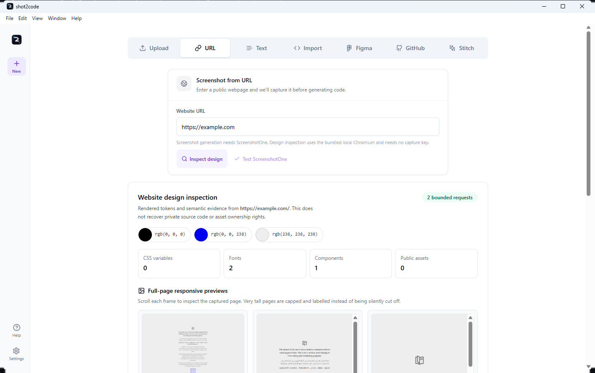
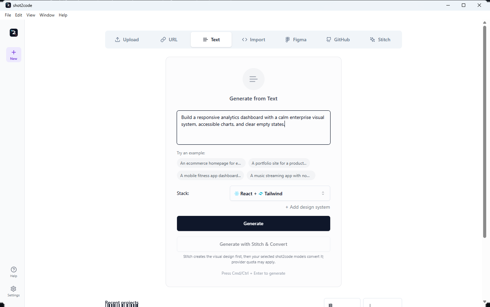
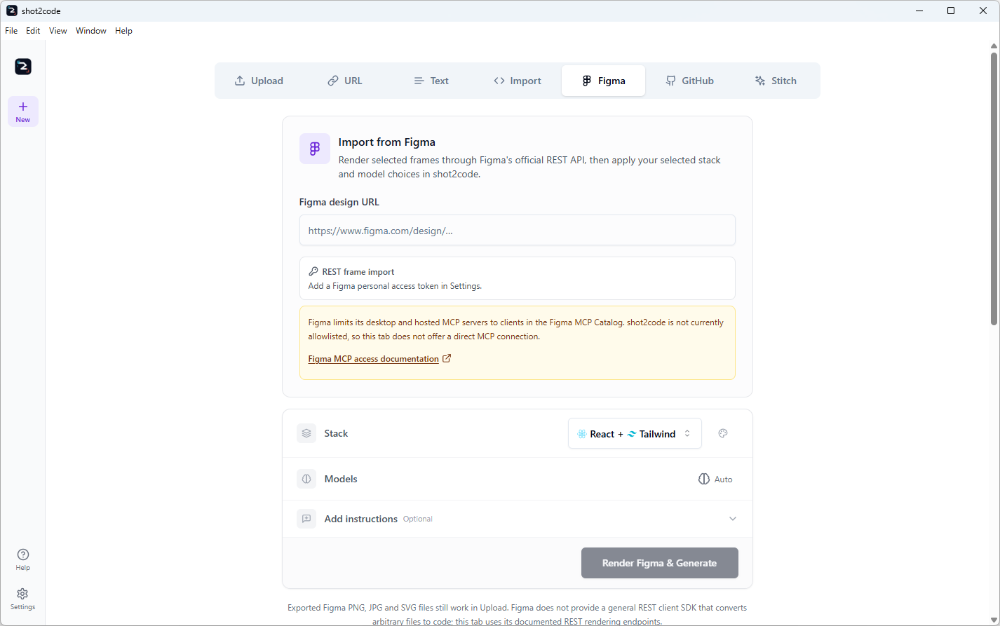
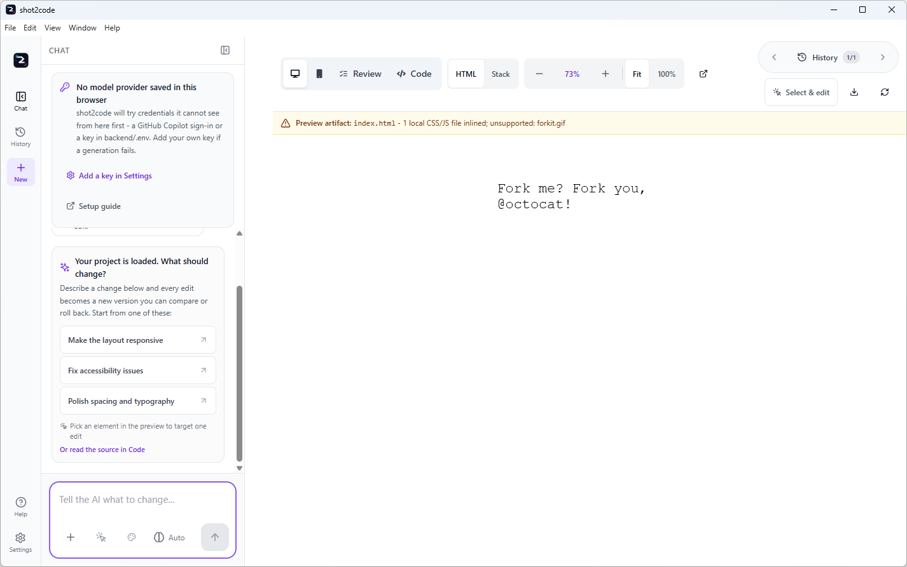

# shot2code input tabs

shot2code has **seven input tabs**. They all create or open the same editable
project workspace, but they start from different evidence:

| Tab | Start here when you have | Provider or credential |
| --- | --- | --- |
| **Upload** | Screenshots, related screens, an exported SVG, or one short video | A code-generation provider; Gemini only for video or optional asset extraction |
| **URL** | A public website to inspect or capture | No key for design inspection; ScreenshotOne only for screenshot capture |
| **Text** | A written UI description | A code-generation provider |
| **Import** | Existing HTML, a folder, ZIP, or selected source files | No provider to open code directly; a provider only for a requested first edit |
| **Figma** | A Figma file/frame link or exported design image | A scoped Figma token for REST import; a code-generation provider for implementation |
| **GitHub** | A public or private frontend repository | No token for public repos; separate fine-grained `Contents: read` token for private repos |
| **Stitch** | A prompt for Google Stitch, or a Stitch project/screen link | A Stitch API key for the bundled SDK, or an enabled and trusted Stitch MCP server |

There is no separate Video tab. Screen recording and video upload live in
**Upload**.

## Upload

Use **Upload** for visual evidence already on your device:

- One to five PNG, JPEG, or SVG screenshots.
- One MP4, MOV, or WebM video instead of screenshots.
- A screen recording started from the same tab.

After adding screenshots, choose how multiple images relate:

- **Separate pages** - one navigable page/view per screenshot.
- **Responsive views** - the same page at different widths.
- **UI states** - one interface before/after an interaction.
- **Supporting references** - the first image is the target and the rest clarify it.

You can select the output stack, choose models, write a first instruction, and
optionally ask Gemini to extract visible logos/images from the original. Each
file is limited to 20 MB; a video is limited to 30 seconds.

**What leaves the device:** the selected screenshots/video and prompt go only
to the model provider chosen for that run. Asset extraction is a separate
Gemini request when enabled.

## URL

The URL tab has two deliberately separate paths.

### Inspect design

**Inspect design** uses bundled local Chromium and needs no ScreenshotOne key.
For a public HTTP(S) page it captures:

- computed colors and CSS custom properties;
- font families, type scale, spacing, radii, shadows, and motion;
- component/landmark counts and basic accessible-name signals;
- public asset references;
- scrollable full-page desktop, tablet, and mobile screenshots with actual
  document/capture dimensions and explicit blank/truncation state;
- an editable, copyable, downloadable `DESIGN.md`.

The result is rendered evidence, not the original source code, a claim of asset
ownership, or a WCAG conformance report. Private, loopback, link-local,
metadata, and mixed public/private DNS destinations are refused. Lazy-content
scrolling is bounded; extreme pages are capped at 40,000px and 36 million
pixels per screenshot rather than silently cut off.

Choose **Use screenshots + DESIGN.md** to send the three responsive screenshots
and the untrusted design report into generation.

### Capture and generate

**Capture & Generate** asks ScreenshotOne to capture the URL, then sends that
image to the selected model lineup. This path needs a ScreenshotOne key and may
consume that provider's quota. The key can be tested from the tab with one
minimal request.

Figma and Stitch URLs are recognized and routed to their dedicated import
behavior rather than treated as ordinary websites.

## Text

Use **Text** when the desired UI can be described without a screenshot:

1. Describe the page, flow, content, visual direction, and responsive behavior.
2. Choose one of the 12 output stacks.
3. Optionally add a saved design system and select one or more models.
4. Generate and compare one option per selected model, subject to the run limit.

The normal **Generate** action goes directly to the selected model provider.
When a Stitch key is configured, **Generate with Stitch & Convert** is an
optional two-stage path: Stitch creates the visual design first, then the
selected shot2code models convert it.

## Import

Use **Import** to continue from code you already own:

- paste HTML or drop one `.html` file;
- choose a project folder;
- choose a ZIP archive;
- choose individual source files.

The third import mode, **Built Storybook**, accepts a built folder, selected
JSON files, ZIP, or public HTTPS build. It parses only `index.json` plus
optional `manifests/components.json` and `manifests/docs.json` into compact
component-library context. Story files, bundles, CSF, addons, decorators,
loaders, play functions and `iframe.html` are never loaded or executed.

The scanner parses text only. It rejects traversal paths, ignores dependency
and build-output directories, enforces file/archive/text limits, and never
loads configuration modules or runs install/build/application code.

After inspection:

- **Use as design context** stores only a compact summary for later prompts.
- **Open editable project** hands normalized files to the editor.
- Pasted HTML opens as one editable History version.

A first instruction is optional. Without one, importing/opening is local and
does not need a model provider.

## Figma

Use **Figma** for a Figma file or selected-frame URL.

1. In Settings, add a Figma personal access token with `file_content:read`.
2. Paste the Figma design URL. A frame-specific link is best because it carries
   the selected node ID.
3. Optionally select **Preview Figma frames** to inspect the rendered evidence
   without a model call.
4. Choose stack/models and select **Render Figma & Generate**. Previewed frames
   are reused rather than downloaded again.

shot2code uses Figma's official REST endpoints to render frames. It also
preserves original image fills and export-marked nodes as bounded local assets.
Optional assets are partial-success: one rate-limited image fill does not
discard frames that already imported.

Figma REST exposes design structure, rendered nodes, and image fills. It does
**not** provide production application source, so the selected model still
creates the implementation. Exported PNG/JPEG/SVG files remain available
through Upload.

shot2code does not offer a direct Figma MCP connection because Figma restricts
desktop and hosted MCP access to clients listed in the Figma MCP Catalog.

## GitHub

Use **GitHub** to open a frontend repository as an editable project.

- Public repositories require no token.
- Private repositories require a **separate fine-grained token** restricted to
  that repository with `Contents: read`.
- The app's Copilot OAuth token is not broadened or silently reused.

The repository archive enters the same never-execute scanner used by Import.
Supported text source is normalized into project files; bounded PNG, JPEG, GIF,
and WebP assets are persisted locally and remain available in Preview, History,
chat refinements, and exports.

The tab explains the two paths before opening:

- Leave **First refinement instruction** blank to inspect and open locally with
  no model request.
- Add an instruction to run an immediate first edit after opening. The tab
  shows the model selector for that edit, with update-run limits and the same
  provider choices used by Chat, plus the selected design system.

The repository's detected frontend stack is preserved. The current default
stack is used only if inspection cannot detect one; the model picker does not
silently convert the repository to another framework.

The repository token is capture-only. It is excluded from model requests, AI
review, History, snapshots, logs, and exported projects.

## Stitch

Use **Stitch** to generate a design through the bundled experimental
`@google/stitch-sdk`, or use the official Stitch MCP server with Copilot
runtimes.

The dedicated tab has two explicit modes:

- **Stitch only** (default) opens Stitch's localized HTML, screenshot, images,
  stylesheets, nested CSS assets/fonts, `srcset`, and available `DESIGN.md`
  directly. No second AI provider is called.
- **Convert to selected stack** sends the imported Stitch evidence through the
  selected shot2code model lineup. Provider quota may apply.

The bundled SDK needs a Stitch API key in Settings. The key is capture-only and
does not enter model prompts or project History. Downloaded assets pass public
DNS, redirect, MIME/magic-byte, file-count, and byte limits before they are
rewritten to restart-safe local assets.

The SDK is published by Google Labs and explicitly described as experimental,
not an officially supported Google product. Stitch does not publish a general
image-generation API or a guaranteed recurring free allowance, so shot2code
does not present it as a replacement for image providers.

## Choosing the right tab

- You have pixels or a recording: **Upload**.
- You want computed design evidence from a public site: **URL -> Inspect design**.
- You want a hosted screenshot of a public URL: **URL -> Capture & Generate**.
- You only have a brief: **Text**.
- You already have code on disk: **Import**.
- You have a Figma file/frame: **Figma**.
- You have repository source: **GitHub**.
- You want Stitch's own output or a Stitch-first conversion: **Stitch**.

All seven paths converge on the same project model: editable files, Preview,
Code, Review, Chat refinements, History, retries, and project export.

For provider setup and the rest of the workspace, return to
[README.md](../README.md). For failures and recovery steps, use
[Troubleshooting.md](../Troubleshooting.md).
